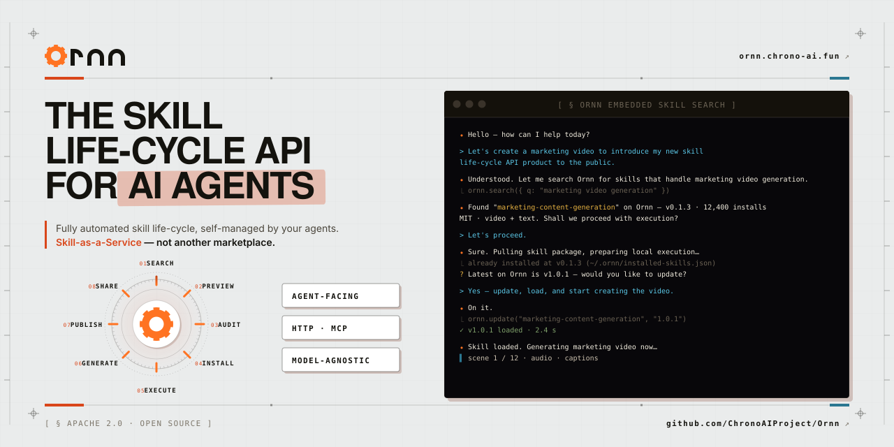

<p align="center">
  <picture>
    <source media="(prefers-color-scheme: dark)" srcset="ornn-web/public/logo-dark.svg">
    
  </picture>
</p>

<p align="center">
  <a href="https://github.com/ChronoAIProject/Ornn/actions/workflows/ci.yml"></a>
  <a href="https://github.com/ChronoAIProject/Ornn/releases"></a>
  <a href="LICENSE"></a>
</p>

<p align="center">
  
</p>

<p align="center"><strong>The agent-facing skill-lifecycle API for AI agents.</strong></p>

<p align="center">
  Ornn official website — <a href="https://ornn.chrono-ai.fun">ornn.chrono-ai.fun</a>
</p>

<p align="center">
  <a href="#what-is-ornn">What is Ornn</a> ·
  <a href="#how-it-works">How it works</a> ·
  <a href="#sdk-quickstart">SDK quickstart</a> ·
  <a href="#quickstart">Quickstart</a> ·
  <a href="#how-ornn-compares">How Ornn compares</a> ·
  <a href="#examples">Examples</a> ·
  <a href="#documentation">Docs</a> ·
  <a href="#roadmap">Roadmap</a> ·
  <a href="#community">Community</a> ·
  <a href="#contributing">Contributing</a>
</p>

---

## What is Ornn

Ornn is an **agent-facing skill-lifecycle API**, not a human marketplace.

The primary consumer is the AI agent developer / agentic-system builder. Agents call Ornn directly — over HTTP or MCP — to manage their own skill lifecycle:

```
search → pull → install → execute → build → upload → share
```

Closest analog: **npm registry + npm CLI fused, model-agnostic** — works for Claude, GPT, Gemini, or any custom runtime. Not locked to a single model.

`ornn-web` is a secondary surface for skill owners and platform admins; it is not the primary product.

## How it works

```
┌──────────────┐    HTTP / MCP    ┌──────────────┐    auth     ┌──────────┐
│   AI agent   │ ───────────────▶ │   ornn-api   │ ──────────▶ │  NyxID   │
│ (any model)  │                  │              │             └──────────┘
└──────────────┘                  │              │   storage   ┌──────────┐
       │                          │              │ ──────────▶ │ MongoDB  │
       │                          │              │             └──────────┘
       │                          │              │   sandbox   ┌──────────┐
       │ pull / execute           │              │ ──────────▶ │ OpenSbox │
       ▼                          └──────────────┘             └──────────┘
┌──────────────┐
│ Local skill  │
│   runtime    │
└──────────────┘
```

The agent talks to `ornn-api` through `nyxid`, which brokers authentication and authorization on the agent's behalf. Skills are versioned artifacts that the agent pulls, runs in a sandbox, and (optionally) publishes back.

For a deeper view, see [`docs/ARCHITECTURE.md`](docs/ARCHITECTURE.md).

## SDK quickstart

Call Ornn directly from code. The SDKs wrap `/api/v1/*` and handle auth header injection, response-envelope unwrapping, and structured errors.

**TypeScript** ([`sdk/typescript`](sdk/typescript))

```bash
# Pre-publish — install from this monorepo via `bun link` or
# git-subdirectory pinning. See docs/SDK_PUBLISHING.md.
bun add @chronoai/ornn-sdk
```

```ts
import { OrnnClient } from "@chronoai/ornn-sdk";

const ornn = new OrnnClient({
  baseUrl: "https://ornn.chrono-ai.fun",
  token: process.env.ORNN_TOKEN,
});
const result = await ornn.search({ q: "pdf parsing" });
console.log(result.items[0]);
```

**Python** ([`sdk/python`](sdk/python))

```bash
pip install ornn-sdk
```

```python
import os
from ornn_sdk import OrnnClient

ornn = OrnnClient(
    base_url="https://ornn.chrono-ai.fun",
    token=os.environ["ORNN_TOKEN"],
)
result = ornn.search(q="pdf parsing")
print(result.items[0])
```

Token sources are pluggable — for dynamic refresh flows, pass `getToken` (TS) / `token_resolver` (Python) instead of a static `token`. See [`sdk/typescript/README.md`](sdk/typescript/README.md) and [`sdk/python/README.md`](sdk/python/README.md) for the full reference.

## Quickstart

> **Status:** alpha. Surfaces and schemas can change before v1. Pin a release tag.

The shortest path to bringing an agent online with Ornn — no manual operator steps inside the agent loop:

1. **Install the ChronoAI core service skill into your agent.** This is the bootstrap skill — it introduces Ornn to the agent and drives the rest of setup.
2. **Let the agent provision the NyxID CLI.** On first run, the core skill instructs the agent to install `nyxid`. The agent follows the skill end-to-end.
3. **Talk to the agent.** Ask it to search, install, run, build, or publish skills. The agent learns the lifecycle through the same API it just connected to.

Once connected, an agent can hit the API directly. A minimal request shape (after `nyxid` is configured):

```bash
nyxid proxy request ornn-api GET /api/v1/skills?q=summarize
```

Full per-endpoint reference: [ornn.chrono-ai.fun/docs](https://ornn.chrono-ai.fun/docs).

## Run Ornn locally (5 minutes)

```bash
git clone https://github.com/ChronoAIProject/Ornn.git
cd Ornn
cp .env.compose.sample .env
docker compose up --build
```

- `ornn-api` on `http://localhost:3802`
- `ornn-web` on `http://localhost:5173`
- MongoDB on `27017`, MinIO console on `9001`

This brings up the data + service layer (Mongo, MinIO, `ornn-api`, `ornn-web`). The auth layer (NyxID) stays external — for end-to-end use against authenticated endpoints, point the API at your own NyxID instance (or the staging instance via the team) by setting `NYXID_BASE_URL`. Public endpoints (`/livez`, `/api/v1/skill-format/rules`, `/api/v1/skill-manifest-schema.json`) work without auth out of the box.

For full production parity (incl. NyxID, chrono-storage, chrono-sandbox, opensandbox), use the Kubernetes manifests under `deployment/` — see [`CONTRIBUTING.md`](CONTRIBUTING.md) for the long-form setup.

## How Ornn compares

The space of agent skill / tool registries is crowded. Quick orientation:

|                                       | **Ornn** | MCP servers | Smithery | npm registry |
|---------------------------------------|:--------:|:-----------:|:--------:|:------------:|
| Agent-callable HTTP API               |    ✓     |   ✓ (RPC)   |    ✗     |      ✓       |
| Model-agnostic (Claude / GPT / …)     |    ✓     |      ✓      |    ✓     |     n/a      |
| Execution sandbox                     |    ✓     |      ✗      |    ✓     |      ✗       |
| Searchable registry (semantic + tag)  |    ✓     |   partial   |    ✓     |    keyword   |
| Versioning + immutable artifacts      |    ✓     |      ✗      |    ?     |      ✓       |
| Skill build pipeline (lint + AgentSeal)| ✓       |      ✗      |    ✗     |      ✗       |
| CLI                                   |   *      |      ✗      |    ✓     |      ✓       |

\* CLI is on the roadmap (Phase 2); today the registry-side CLI is `nyxid proxy request ornn-api …`. The web UI at [ornn.chrono-ai.fun](https://ornn.chrono-ai.fun) covers human flows.

**What this means in practice**

- **vs MCP servers** — MCP is a protocol for calling tools the agent already has access to; Ornn is the registry + lifecycle around those tools (discover, version, sandbox, build, publish). The two compose: an Ornn-hosted skill can expose an MCP transport.
- **vs Smithery** — Smithery is a curated UI registry for MCP servers; Ornn is an API-first registry callable directly by agents, with build/execute primitives included.
- **vs npm registry** — npm versions and ships code; it doesn't know about models, sandboxes, or skill manifests. Ornn does.

Treat the table as a working draft — corrections welcome via [Discussions → Ideas](https://github.com/ChronoAIProject/Ornn/discussions/categories/ideas).

## Examples

Three minimal starter skills under [`examples/`](examples) — fork as the starting point for your own. Each one is ~60 lines, runs locally, and demonstrates one of the failure-mode archetypes you'll hit in production:

| Skill | What it shows |
|---|---|
| [`text-summarizer`](examples/text-summarizer) | LLM-backed work — model API call, structured I/O |
| [`csv-processor`](examples/csv-processor) | Pure local computation — file in, JSON out, deterministic |
| [`api-fetch-wrapper`](examples/api-fetch-wrapper) | External HTTP — secret handling, retries, no-leak errors |

See [`examples/README.md`](examples/README.md) for the anatomy of an Ornn skill + how to adapt one.

## Documentation

- **Product docs** — [ornn.chrono-ai.fun/docs](https://ornn.chrono-ai.fun/docs)
- **Architecture** — [`docs/ARCHITECTURE.md`](docs/ARCHITECTURE.md)
- **Conventions** — [`docs/CONVENTIONS.md`](docs/CONVENTIONS.md)
- **API stability & deprecation** — [`docs/API_STABILITY.md`](docs/API_STABILITY.md)
- **Design system** — [`docs/DESIGN.md`](docs/DESIGN.md)

## Roadmap

Tracked publicly on GitHub:

- **Open issues & milestones** — [Issues](https://github.com/ChronoAIProject/Ornn/issues) · [Milestones](https://github.com/ChronoAIProject/Ornn/milestones)
- **What shipped** — [Releases](https://github.com/ChronoAIProject/Ornn/releases) · per-package changelogs in [`ornn-api/CHANGELOG.md`](ornn-api/CHANGELOG.md) and [`ornn-web/CHANGELOG.md`](ornn-web/CHANGELOG.md)

## Community

- **Questions / how-to** → [Discussions → Q&A](https://github.com/ChronoAIProject/Ornn/discussions/categories/q-a)
- **Ideas / RFCs** → [Discussions → Ideas](https://github.com/ChronoAIProject/Ornn/discussions/categories/ideas)
- **Show off your agent integration** → [Discussions → Show & Tell](https://github.com/ChronoAIProject/Ornn/discussions/categories/show-and-tell)
- **Bug or feature** → [open an issue](https://github.com/ChronoAIProject/Ornn/issues/new/choose)
- **Security report** → [Private Vulnerability Reporting](https://github.com/ChronoAIProject/Ornn/security/advisories/new) — see [SECURITY.md](SECURITY.md)
- **Support guide** → [SUPPORT.md](SUPPORT.md)

## Contributing

Pull requests are welcome. Before opening one, read [CONTRIBUTING.md](CONTRIBUTING.md) — it covers the issue-first workflow, branching, commit decomposition, and the changeset rule (CI blocks PRs without one).

By participating you agree to follow our [Code of Conduct](CODE_OF_CONDUCT.md).

## License

[Apache License 2.0](LICENSE)
