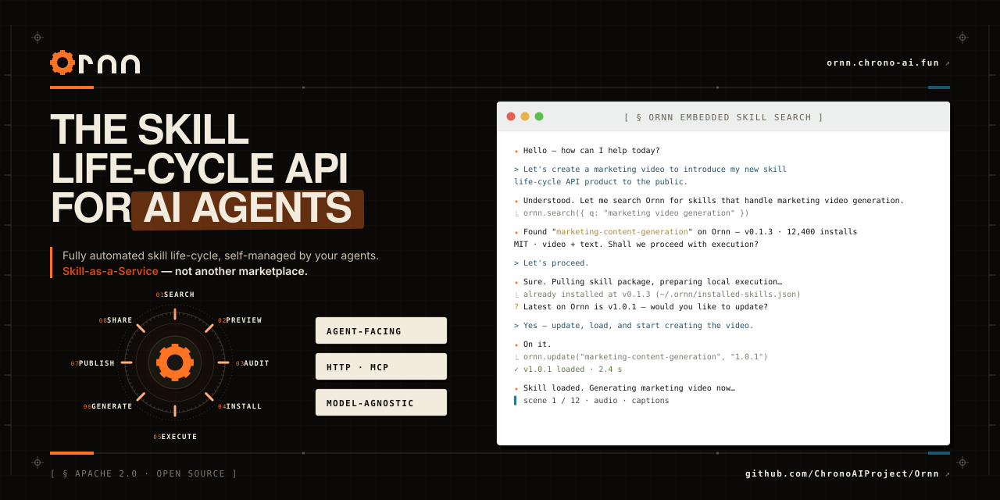
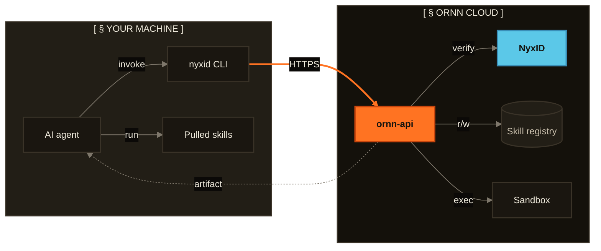

  

  
  
  
  &nbsp;<strong>The skill lifecycle API for AI agents, not another marketplace.</strong>

---

## What is Ornn

Ornn is an **agent-facing skill-lifecycle API**, not a human marketplace.

- 🤖 **Agents call it directly** — over HTTP or MCP, no human-in-the-loop UI required.
- 🌐 **Model + runtime agnostic** — Claude, GPT, Gemini, or your own runtime; stable schemas so swapping doesn't break the stack.
- 🔁 **Whole lifecycle in one API** — `search → pull → install → execute → build → upload → share`.

Closest analog: **npm registry + npm CLI fused, model-agnostic**. The primary consumer is the AI agent developer / agentic-system builder; `ornn-web` is a secondary surface for skill owners and platform admins.

## How it works

Every API call is mediated by [`nyxid`](https://github.com/ChronoAIProject/NyxID) — the shared identity + brokering layer ChronoAI uses across products. The agent never holds a long-lived token: `nyxid` refreshes credentials transparently and brokers per-service access for each request.

## Quickstart

> **Status:** alpha. The API surface can still change before v1 — pin a release tag if you ship to production.

### 1. Create a NyxID account

Sign up at [**nyx.chrono-ai.fun**](https://nyx.chrono-ai.fun) with invite code **`NYX-2XXJI08A`**. Sign in with **GitHub**, **Google**, or **Apple** — NyxID is the identity layer that authenticates every Ornn API call. One account covers every ChronoAI service.

### 2. Install the Ornn agent manual into your AI agent

Open [**`ornn-agent-manual-cli`**](https://ornn.chrono-ai.fun/skills/ornn-agent-manual-cli) and follow the install instructions for your agent runtime (Claude Code, OpenAI Codex, Cursor, …). This skill is the **operational manual Ornn ships for AI agents**: once it's loaded into your agent, the agent knows how to drive the full `search → pull → execute → build → upload → share` lifecycle on its own — no further hand-holding required.

Partway through setup, your agent will prompt you to install [**`nyxid`**](https://github.com/ChronoAIProject/NyxID) — the CLI Ornn calls under the hood to broker authenticated requests. Approve the prompt; the agent finishes onboarding itself.

### 3. Talk to your agent

That's it. Your agent now has the full Ornn lifecycle. Try any of these in plain language — no special syntax, no flags to memorise:

- **Search the registry.**
  > *"Find me a skill that converts CSV to JSON."*

  Hits semantic + keyword search across every public skill.

- **Pull and install a skill.**
  > *"Pull and install the skill `pdf-extractor`, then use it on `report.pdf`."*

  Fetches the latest versioned artifact into your local runtime and runs it.

- **Trigger a security audit.**
  > *"Run a security audit on the skill `web-scraper`."*

  Kicks the AgentSeal pipeline against a published version — static analysis, sandbox probe, dependency scan.

- **Build and publish a new skill.**
  > *"Build me a skill that summarises RSS feeds and upload it under my account."*

  Drives `ornn-build` to generate the skill, packages it, and publishes a new version through your NyxID identity.

For the full API contract (every endpoint, every error code), see [**ornn.chrono-ai.fun/docs**](https://ornn.chrono-ai.fun/docs).

## Community and Contributing

- **Questions / how-to** → [Discussions → Q&A](https://github.com/ChronoAIProject/Ornn/discussions/categories/q-a)
- **Ideas / RFCs** → [Discussions → Ideas](https://github.com/ChronoAIProject/Ornn/discussions/categories/ideas)
- **Show off your agent integration** → [Discussions → Show & Tell](https://github.com/ChronoAIProject/Ornn/discussions/categories/show-and-tell)
- **Bug or feature** → [open an issue](https://github.com/ChronoAIProject/Ornn/issues/new/choose)
- **Roadmap** → [Issues](https://github.com/ChronoAIProject/Ornn/issues) · [Milestones](https://github.com/ChronoAIProject/Ornn/milestones) · [Releases](https://github.com/ChronoAIProject/Ornn/releases)
- **Security report** → [Private Vulnerability Reporting](https://github.com/ChronoAIProject/Ornn/security/advisories/new) (see [SECURITY.md](SECURITY.md))
- **Support guide** → [SUPPORT.md](SUPPORT.md)
- **Pull requests** → read [CONTRIBUTING.md](CONTRIBUTING.md) first — it covers the issue-first workflow, branching, commit decomposition, and the changeset rule (CI blocks PRs without one). By participating you agree to follow our [Code of Conduct](CODE_OF_CONDUCT.md).

## License

[Apache License 2.0](LICENSE)
