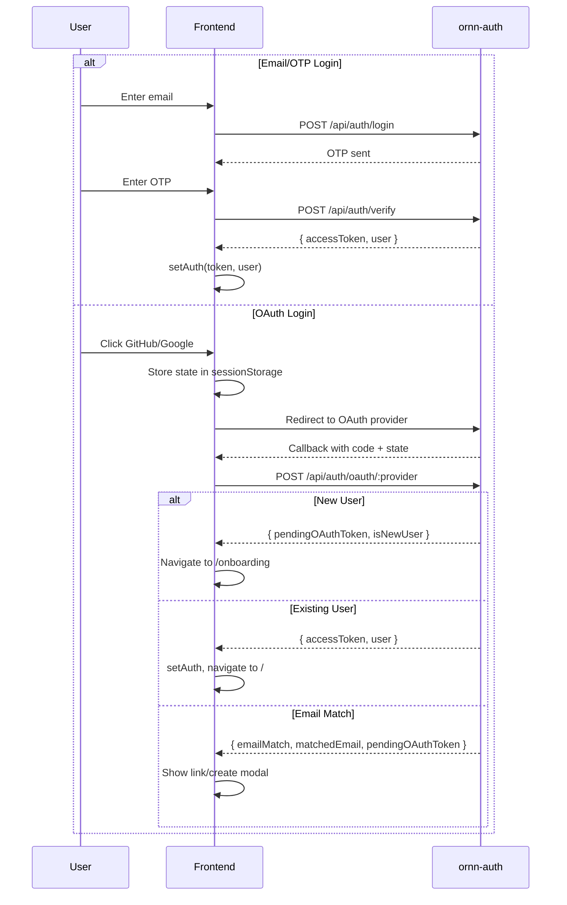
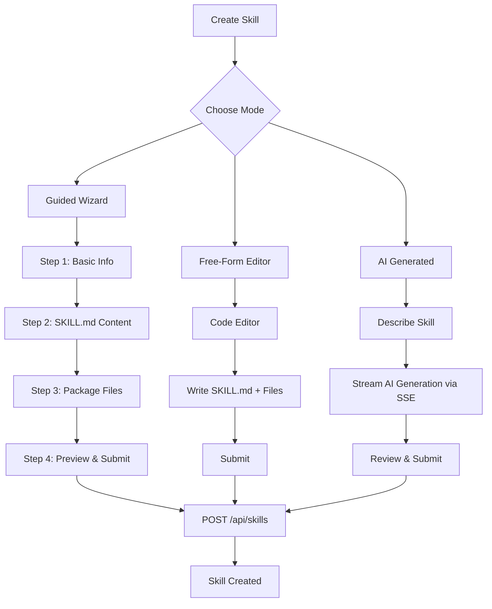
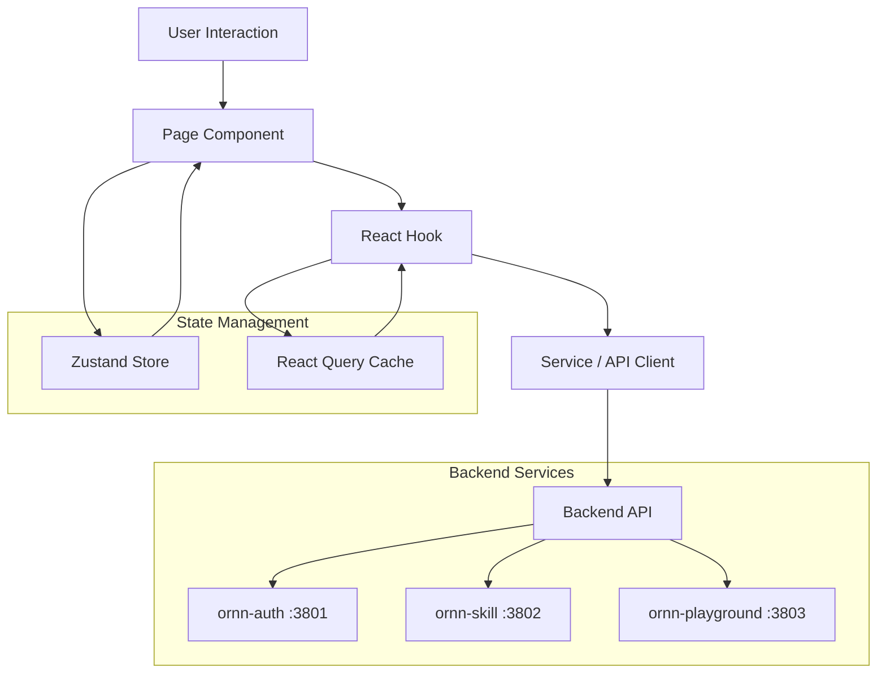
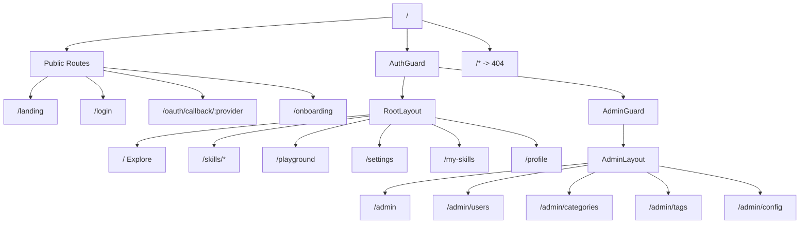

# Requirements -- ornn-frontend

## Overview

ornn-frontend is the web-based single-page application (SPA) for the Ornn skill platform. Built with React, TypeScript, and Tailwind CSS 4, it provides a user interface for browsing, creating, editing, uploading, and testing AI skills. It communicates with three backend microservices (ornn-auth, ornn-skill, ornn-playground) through API proxying.

## Functional Requirements

### FR-1: Authentication

- FR-1.1: The system shall support email/OTP-based login. Users enter their email, receive a one-time password, and authenticate.
- FR-1.2: The system shall support OAuth login via GitHub and Google providers.
- FR-1.3: OAuth callback handling shall support two modes: login mode (new session) and link mode (linking an OAuth provider to an existing account).
- FR-1.4: In link mode, if the access token has expired, the system shall attempt a token refresh before calling the link endpoint.
- FR-1.5: If the refresh fails in link mode, the system shall display a "session expired" error.
- FR-1.6: On OAuth conflict (provider already linked to another user), the system shall display an error with a "Back to Settings" action.
- FR-1.7: OAuth login mode shall handle email matches -- when the OAuth email matches an existing account, a modal shall present options to "Link to Existing Account" or "Create New Account".
- FR-1.8: The email match modal shall display the actual matched email address and store a pending OAuth token in sessionStorage.
- FR-1.9: Deferred user creation shall be supported -- when the backend returns a `pendingOAuthToken` without user/tokens, the user shall be redirected to onboarding with the token.
- FR-1.10: JWT access tokens shall be stored in-memory (Zustand store). User info shall be persisted to localStorage.
- FR-1.11: The auth store shall support auto-refresh of access tokens.
- FR-1.12: SessionStorage shall be cleaned up after OAuth flows complete (both success and failure).

### FR-2: Onboarding

- FR-2.1: New users shall complete an onboarding flow to set up their profile (display name, optional avatar, optional phone number).
- FR-2.2: The onboarding page shall support two modes: authenticated mode (for email/OTP users with an existing session) and pending OAuth mode (for deferred OAuth creation without a session).
- FR-2.3: In authenticated mode, OTP sending shall call the authenticated endpoint with the access token.
- FR-2.4: In pending OAuth mode, OTP sending shall call the unauthenticated endpoint with the pending OAuth token.
- FR-2.5: In authenticated mode, completion shall call the authenticated onboarding endpoint and update the user in the auth store.
- FR-2.6: In pending OAuth mode, completion shall call the OAuth onboarding endpoint, receive tokens, and set the auth session.
- FR-2.7: The system shall fall back to sessionStorage for the pending OAuth token when route state is unavailable (e.g., page refresh).
- FR-2.8: Expired pending tokens shall be detected and sessionStorage cleaned up.
- FR-2.9: Users who do not need onboarding and are not in pending OAuth mode shall be redirected to login.
- FR-2.10: Email verification shall be required when `requireEmailVerification` is set in route state or when in pending OAuth mode.

### FR-3: Route Protection

- FR-3.1: `AuthGuard` shall wrap all authenticated routes and redirect unauthenticated users to `/login`.
- FR-3.2: `AuthGuard` shall redirect users who need onboarding to `/onboarding`.
- FR-3.3: `AdminGuard` shall wrap `/admin/*` routes and require the user's role to be `admin`.

### FR-4: Skill Discovery and Browsing

- FR-4.1: The explore page (`/`) shall display skills in a grid layout with search and filtering.
- FR-4.2: Each skill card shall show the skill name, description, category, and tags.
- FR-4.3: The skill detail page shall display full skill metadata, SKILL.md content (rendered README), package files, version history, and a download option.
- FR-4.4: The file browser shall show a tree view of package files with syntax-highlighted content viewing.
- FR-4.5: Skills shall have a public/private toggle for visibility control.
- FR-4.6: Version history shall be displayed with a version selector dropdown.

### FR-5: Skill Creation

- FR-5.1: Three creation modes shall be available: guided wizard, free-form editor, and AI-generated.
- FR-5.2: The guided wizard shall have four steps: basic info (name, description, category), SKILL.md content, package files, and preview/submit.
- FR-5.3: The free-form editor shall provide a code editor for directly writing SKILL.md and package files.
- FR-5.4: AI-generated creation shall stream skill content as it is produced, using SSE.
- FR-5.5: Skill names shall be validated: 1-64 characters, lowercase, no leading hyphen, no uppercase.
- FR-5.6: Category selection shall enforce conditional rules -- `tool-based` requires at least one tool, `runtime-based` requires at least one runtime, `mixed` requires both, `plain` prohibits runtime/tool fields.
- FR-5.7: Environment variable names shall be validated as uppercase with underscores/numbers only.
- FR-5.8: Tags shall be limited to 10 maximum, each up to 30 characters.

### FR-6: Skill Upload

- FR-6.1: Users shall be able to upload skill packages as ZIP files.
- FR-6.2: Uploaded ZIPs shall be validated on the client side.
- FR-6.3: New versions of existing skills shall be uploadable via a dedicated version upload page.

### FR-7: Skill Editing

- FR-7.1: Users shall be able to edit skill metadata for their own skills.
- FR-7.2: The edit page shall pre-populate with existing skill data.

### FR-8: GitHub Import

- FR-8.1: Users shall be able to import skills from GitHub repositories.
- FR-8.2: The import wizard shall support selecting a repository URL, branch, and specific files.
- FR-8.3: Import state shall be managed through a dedicated Zustand store.

### FR-9: Skill Playground

- FR-9.1: The playground shall provide an interactive chat interface for testing skills with an LLM.
- FR-9.2: Chat messages shall stream in real-time using SSE.
- FR-9.3: Tool calls and their results shall be visualized with dedicated card components.
- FR-9.4: A tool approval banner shall prompt users to approve or reject tool executions.
- FR-9.5: The sidebar shall provide credential management and LLM configuration panels.
- FR-9.6: LLM configuration shall support selecting model, temperature, and other parameters.
- FR-9.7: Playground sessions and message history shall be managed through a Zustand store.

### FR-10: Semantic Search (Resolve)

- FR-10.1: Users shall be able to perform semantic search for skills using natural language queries.
- FR-10.2: Search results shall stream with phased progress indicators.
- FR-10.3: Each search result shall display relevance information.
- FR-10.4: AI-generated summaries shall be displayed with streaming token visualization.

### FR-11: User Settings

- FR-11.1: Users shall be able to view and edit their profile (display name, avatar, phone number).
- FR-11.2: Users shall be able to change their email address.
- FR-11.3: Users shall be able to manage linked OAuth accounts (link/unlink GitHub, Google).
- FR-11.4: Users shall be able to view and manage their API keys.
- FR-11.5: Avatar upload shall be supported.

### FR-12: Admin Panel

- FR-12.1: The admin dashboard shall show platform statistics.
- FR-12.2: Admins shall be able to manage users (view, ban/unban).
- FR-12.3: Admins shall be able to manage skill categories.
- FR-12.4: Admins shall be able to manage tags.
- FR-12.5: Admins shall be able to view and modify platform configuration.

### FR-13: SKILL.md Frontmatter Handling

- FR-13.1: The system shall parse both old flat frontmatter format and new nested metadata format.
- FR-13.2: Old flat frontmatter shall be automatically mapped to the new nested format (e.g., `tools_required` to `tool-based`, `runtime_required` to `runtime-based`).
- FR-13.3: YAML keys shall be converted between hyphenated (YAML) and camelCase (TypeScript) representations.
- FR-13.4: The frontmatter builder shall emit valid YAML with proper nesting, quoting special characters, and omitting default values.
- FR-13.5: Frontmatter validation shall enforce category-specific conditional rules via Zod schemas.
- FR-13.6: Validation errors shall include field path and human-readable message.
- FR-13.7: `stripFrontmatter()` shall extract just the body content after the frontmatter block.
- FR-13.8: Windows line endings shall be normalized during parsing.

### FR-14: UI Components

- FR-14.1: The `ValidationErrorPanel` shall display validation errors with field paths and messages, using an alert role for accessibility.
- FR-14.2: The `ValidationErrorPanel` shall return null when the error list is empty.
- FR-14.3: The `ValidationErrorPanel` shall support custom titles and singular/plural error counts.
- FR-14.4: Empty field paths shall display as "root".
- FR-14.5: `FrontmatterMeta` shall display tool requirements, dependencies, environment variables, compatibility, and runtime information extracted from SKILL.md content.
- FR-14.6: `FrontmatterMeta` shall handle both old flat and new nested frontmatter formats.
- FR-14.7: `FrontmatterMeta` shall return null when there is no frontmatter or when metadata is empty (plain category with no tools/deps/env).
- FR-14.8: Toast notifications shall be queued through a Zustand store with success, error, and info message types.

### FR-15: Landing Page

- FR-15.1: A public landing page shall be accessible at `/landing` without authentication.
- FR-15.2: The landing page shall include a hero section, skills showcase, framework section, and footer.

## Non-Functional Requirements

- NFR-1: The frontend shall be a static SPA. No server-side environment variables are needed at runtime.
- NFR-2: API routing in development shall use Vite's proxy configuration. In production, nginx handles proxying.
- NFR-3: SSE streaming shall work correctly in both development (Vite proxy) and production (nginx) with proper headers (`Connection: ''`, `proxy_buffering off`).
- NFR-4: React Query shall be configured with 30-second stale time, 1 retry, and no refetch on window focus.
- NFR-5: The UI shall use Tailwind CSS 4 with a custom neon theme defined via CSS custom properties.
- NFR-6: Route transitions shall be animated using framer-motion.
- NFR-7: A global error boundary shall catch and display unhandled React errors.
- NFR-8: Secrets and credentials shall never be stored in the frontend. All sensitive operations go through backend APIs.

## Diagrams

### Authentication Flow

### Skill Creation Modes

### Frontend Architecture

### Route Structure

