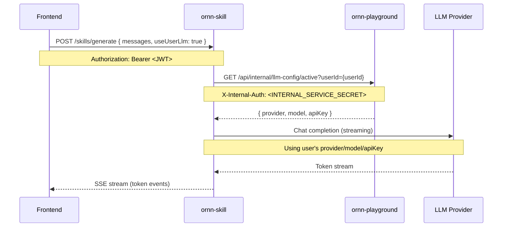

# Architecture

ornn-skill is the skill management microservice for the Ornn platform. It provides CRUD operations for skill packages, unified search (keyword and vector similarity), format validation for skill packages, and LLM-powered skill generation via SSE streaming. Built on the Bun runtime with Hono as the HTTP framework.

## Directory Structure

```
src/
  index.ts                          # Entry point: loads config, creates logger, starts Bun server
  bootstrap.ts                      # Wires up connections, repositories, services, clients, and domain routes
  config.ts                         # SkillConfig interface and loadConfig() from environment variables

  clients/
    authClient.ts                   # HTTP client to ornn-auth (API key validation)
    storageClient.ts                # HTTP client to ornn-storage (S3 file upload, delete, pre-signed URLs)

  services/
    jwtVerifier.ts                  # Local JWT access token verifier using shared JWT_SECRET

  domains/
    skillCrud/
      index.ts                      # Domain factory: creates SkillService, mounts skillRoutes + formatRulesRoutes
      routes/
        skillRoutes.ts              # POST/GET/PUT/DELETE /skills — CRUD endpoints (ZIP upload, authenticated)
        formatRulesRoutes.ts        # GET /skill-format/rules (anonymous), POST /skill-format/validate (authenticated)
      services/
        skillService.ts             # Core CRUD business logic: create, read, update, delete skills
        skillService.interface.ts   # ISkillService interface definition
        skillFormatValidator.ts     # ZIP package validation against format rules (structure, frontmatter, naming)
        skillMdParser.ts            # Parses SKILL.md YAML frontmatter into structured ParsedSkillMd
        skillMapper.ts              # DTO mapper: SkillDocument to SkillSearchItem
      repositories/
        skillRepository.ts          # MongoDB-backed skill repository (CRUD, keyword search, scope filtering)
        skillRepository.interface.ts # ISkillRepository, SkillDocument, SkillMetadata, CreateSkillData, UpdateSkillData
      types/
        api.ts                      # API response types: SkillDetailResponse, SkillSearchItem, SkillSearchResponse
      utils/
        skillPackageBuilder.ts      # Builds virtual .tar.gz archives from individual files and metadata

    skillSearch/
      index.ts                      # Domain factory: creates unified search route (GET /skill-search)
      routes/
        searchRoutes.ts             # GET /skill-search — unified search with keyword/similarity modes, JWT or API key auth
      services/
        embeddingService.ts         # SBERT embedding generation via @xenova/transformers (all-MiniLM-L6-v2, 384-dim)
        semanticSearchService.ts    # Semantic search with FTS fallback and optional auto-generation
        skillDiscoveryService.ts    # Two-phase discovery: exact name match then similarity fallback
        skillPackageReader.ts       # Reads package content (SKILL.md + files) for MCP include_package support
      repositories/
        embeddingRepository.ts      # Milvus-backed vector storage (upsert, ANN search, remove) + NullEmbeddingRepository
        searchRepository.ts         # MongoDB $text search fallback repository
      middleware/
        apiKeyMiddleware.ts         # API key authentication middleware (validates Bearer sk_... via ornn-auth)
      types/
        search.ts                   # UnifiedSearchParams type definition
      utils/
        queryLock.ts                # In-memory deduplication lock for concurrent identical queries

    skillGeneration/
      index.ts                      # Domain factory: creates AI generation route (POST /skills/generate), conditional on LLM config
      routes/
        skillGenerateRoutes.ts      # POST /skills/generate — multipart or JSON, streams generation via SSE
      services/
        skillGenerationService.ts   # LLM-powered generation with streaming, validation, and retry logic
        llmClient.ts                # OpenAI API client (chat completions, streaming and non-streaming)
        promptTemplates.ts          # System and user prompt templates for skill generation
      types/
        generation.ts               # GeneratedSkill and LlmOptions types
        streaming.ts                # SkillStreamEvent discriminated union (generation_start, token, complete, error)

  shared/
    types/
      schemas.ts                    # Zod schemas: skillSearchQuerySchema, generateQuerySchema
    utils/
      embedding.ts                  # computeSkillEmbedding(): shared helper for computing and persisting embeddings
      frontmatter.ts                # extractFrontmatter() and validateFrontmatter() using Zod schema from ornn-shared
      frontmatterAdapter.ts         # Backward-compat adapter: old flat frontmatter to new nested metadata structure
      archive.ts                    # Archive extraction utilities (tar.gz, zip) via Bun.spawn
      tarBuilder.ts                 # POSIX tar buffer creation for virtual archive assembly
```

## Domain Breakdown

### skillCrud

Handles all skill lifecycle operations and format validation.

- **CRUD** -- Create, read, update, and delete skills. Skills are uploaded as ZIP packages, validated, stored in S3 via ornn-storage, and indexed in MongoDB. Each write operation also computes a 384-dimensional SBERT embedding and upserts it to Milvus for similarity search.
- **Format rules** -- `GET /skill-format/rules` returns the canonical validation rules for skill packages as markdown. Anonymous access.
- **Format validation** -- `POST /skill-format/validate` validates an uploaded ZIP against all format rules (folder naming, SKILL.md presence and case, frontmatter schema, allowed root items, metadata constraints). Returns all violations rather than failing on the first.
- **Package parsing** -- `skillMdParser` extracts YAML frontmatter from SKILL.md and maps it into a structured `ParsedSkillMd` with backward compatibility for old flat formats via `frontmatterAdapter`.

### skillSearch

Provides unified search across skills with support for two authentication modes.

- **Keyword search** -- Text-based search against skill metadata in MongoDB (exact GUID match + name/description regex). Results are paginated and scope-filtered (public, private, mixed).
- **Similarity search** -- Vector-based semantic search using SBERT embeddings stored in Milvus. Query text is embedded at request time, then an ANN search retrieves the top matching skill IDs. Results are post-filtered by scope and paginated.
- **Combined auth** -- The search endpoint accepts either JWT tokens (web UI) or API keys with `sk_` prefix (ornn-mcp). API keys are validated via an HTTP call to ornn-auth.
- **Discovery service** -- Two-phase search (exact name then similarity fallback) used by external MCP clients. Supports optional package content loading.
- **Semantic search service** -- Advanced search with FTS fallback and optional auto-generation when no results are found.

### skillGeneration

LLM-powered skill generation via SSE streaming.

- **SSE streaming** -- `POST /skills/generate` accepts a text prompt (and optional existing skill package ZIP), then streams generation events to the client in real time. Events include `generation_start`, `token` (incremental LLM output), `generation_complete`, `validation_error`, and `error`.
- **OpenAI integration** -- Uses the OpenAI chat completions API (streaming and non-streaming) via a configurable model (default: gpt-4o). The LLM client supports configurable timeouts for both request and stream modes.
- **Prompt engineering** -- Detailed system prompts constrain the LLM to produce valid skill JSON with the correct schema. Generated skills are limited to `plain` or `runtime-based` categories.
- **Validation and retry** -- LLM output is parsed, cleaned of markdown fences, and validated against a Zod schema. If validation fails, the service retries once with stricter instructions before returning an error.
- **No auto-persist** -- The generation endpoint streams raw output for client preview. Persisting the generated skill is a separate client-side action.

## External Dependencies

| Dependency             | Purpose                                                          |
|------------------------|------------------------------------------------------------------|
| ornn-auth              | Validating API keys for external consumers (search/MCP endpoints)|
| ornn-storage           | Storing and retrieving skill package ZIP files in S3             |
| ornn-shared            | Shared middleware (auth, logging, error handler), DB connectors, types, Zod schemas |
| MongoDB                | Primary data store for skill metadata (skills collection)        |
| Milvus                 | Vector database for 384-dim SBERT embeddings (similarity search) |
| OpenAI API             | LLM for AI-powered skill generation (chat completions)           |
| @xenova/transformers   | Local SBERT embedding generation (all-MiniLM-L6-v2 ONNX model)  |
| Hono                   | HTTP framework (routing, middleware, SSE streaming)               |
| Zod                    | Runtime schema validation for query params and LLM output        |
| JSZip                  | ZIP file parsing and content extraction                          |
| YAML (yaml)            | YAML frontmatter parsing in SKILL.md                             |

## Data Flow

### Standard CRUD Request

```
HTTP request
  -> Hono requestLogger middleware (ornn-shared)
  -> Hono onError handler (ornn-shared)
  -> auth middleware (JWT verification via jwtVerifier)
  -> route handler (skillRoutes / formatRulesRoutes)
  -> service (SkillService business logic)
  -> repository (SkillRepository for MongoDB)
  -> StorageClient (HTTP to ornn-storage for S3)
  -> EmbeddingService + EmbeddingRepository (SBERT + Milvus, fire-and-forget)
```

### Search Request

```
HTTP request
  -> requestLogger + errorHandler
  -> combined auth middleware (JWT or API key via ornn-auth)
  -> searchRoutes handler
  -> Zod schema validation (skillSearchQuerySchema)
  -> keyword mode: SkillRepository.keywordSearch() -> MongoDB
  -> similarity mode: EmbeddingService.embed() -> EmbeddingRepository.searchSimilar() -> Milvus ANN
     -> SkillRepository.findByGuids() -> MongoDB (fetch full docs)
     -> scope post-filter + similarity-order pagination
```

### Generation Request

```
HTTP request
  -> requestLogger + errorHandler
  -> auth middleware (JWT)
  -> skillGenerateRoutes handler (parse multipart or JSON)
  -> optional: analyzePackageContent() (extract ZIP content for context)
  -> SkillGenerationService.generateStreamDirect()
     -> promptTemplates.buildDirectGenerationPrompt()
     -> OpenAILlmClient.completeStream() (SSE token streaming)
     -> parseAndValidate() (JSON extraction + Zod schema)
     -> retry on validation failure
  -> SSE stream to client (with keep-alive heartbeats)
```

## MongoDB Collection

| Collection | Description                                              |
|------------|----------------------------------------------------------|
| skills     | Skill metadata, ownership, visibility, and S3 references |

The `skills` collection uses `_id` as the skill GUID. Key fields: `name`, `description`, `license`, `compatibility`, `metadata` (nested object with category, runtimes, tools, tags), `skillHash`, `s3Url`, `createdBy`, `createdOn`, `updatedBy`, `updatedOn`, `isPrivate`.

## Milvus Collection

| Collection        | Description                                          |
|-------------------|------------------------------------------------------|
| skill_embeddings  | 384-dimensional SBERT vectors for similarity search  |

Fields: `skill_id` (UUID), `embedding` (384-dim float vector), `model` (string identifying the embedding model). Uses HNSW index with `ef=128` for ANN search.

## Embedding Pipeline

When a skill is created or updated via ZIP upload:

1. Parse SKILL.md from the ZIP to extract `name` and `description`.
2. Compose search text as `"${name} ${description}"`, truncated to 8192 characters.
3. Generate a 384-dimensional embedding using the local SBERT model (all-MiniLM-L6-v2 via @xenova/transformers ONNX runtime).
4. Upsert the embedding vector into the Milvus `skill_embeddings` collection (delete-then-insert).
5. Embedding computation is fire-and-forget -- failures are logged but do not block the CRUD response.

The SBERT model is lazy-loaded on first embed() call and cached as a singleton. Concurrent calls during loading share the same promise.

## Multi-Turn Generation with User LLM Config

The skill generation endpoint supports a multi-turn, chat-based generation mode where users can iteratively refine skills through conversation. When the user opts in, generation uses the user's own LLM configuration (provider, model, API key) stored in ornn-playground rather than the platform's default OpenAI key.

### Request Format

`POST /skills/generate` accepts two body formats:

- **Multi-turn (new):** `{ messages: [{ role, content }], useUserLlm?: boolean }`
- **Legacy (backward-compatible):** `{ prompt: string }` -- converted internally to a single-message array

When `useUserLlm: true`, ornn-skill fetches the user's active LLM config from ornn-playground via its internal endpoint and uses that provider/model/key for generation instead of the platform default.

### Service-to-Service Flow



## Key Design Decisions

- **Domain-driven structure** -- Code is organized into three domains (`skillCrud`, `skillSearch`, `skillGeneration`), each with its own routes, services, repositories, types, and utils. Each domain has an `index.ts` factory that wires up its dependencies and exposes a Hono router.
- **Dual search strategy** -- Combining keyword search (MongoDB regex) with vector similarity search (Milvus ANN) provides both precise text matching and semantic understanding.
- **SBERT embeddings (384-dim)** -- The all-MiniLM-L6-v2 model runs locally via ONNX, avoiding external API calls for embedding generation. 384 dimensions balance quality and storage efficiency.
- **Combined auth on search** -- The search endpoint accepts both JWT (web UI) and API key (ornn-mcp) authentication, enabling both interactive and programmatic access.
- **SSE for generation** -- Streaming generation progress token-by-token gives users real-time feedback rather than waiting for potentially long LLM completions.
- **ZIP validation at ingestion** -- Validating skill packages on upload ensures only well-formed packages enter the system. All violations are collected rather than failing on the first, giving users a complete error report.
- **Client-based service integration** -- HTTP clients in `src/clients/` abstract away service-to-service communication with ornn-auth and ornn-storage, keeping domain code decoupled from transport details.
- **Null object pattern for Milvus** -- `NullEmbeddingRepository` allows the service to operate without Milvus (similarity search returns empty results), enabling graceful degradation in development or when vector search is not configured.
- **Conditional AI domain** -- The skillGeneration domain is only mounted when an LLM API key is configured, making it optional in deployments that do not need generation capabilities.
- **Interface-driven design** -- All repositories and services define explicit interfaces (`ISkillRepository`, `ISkillService`, `IEmbeddingService`, etc.), enabling testability via dependency injection.
