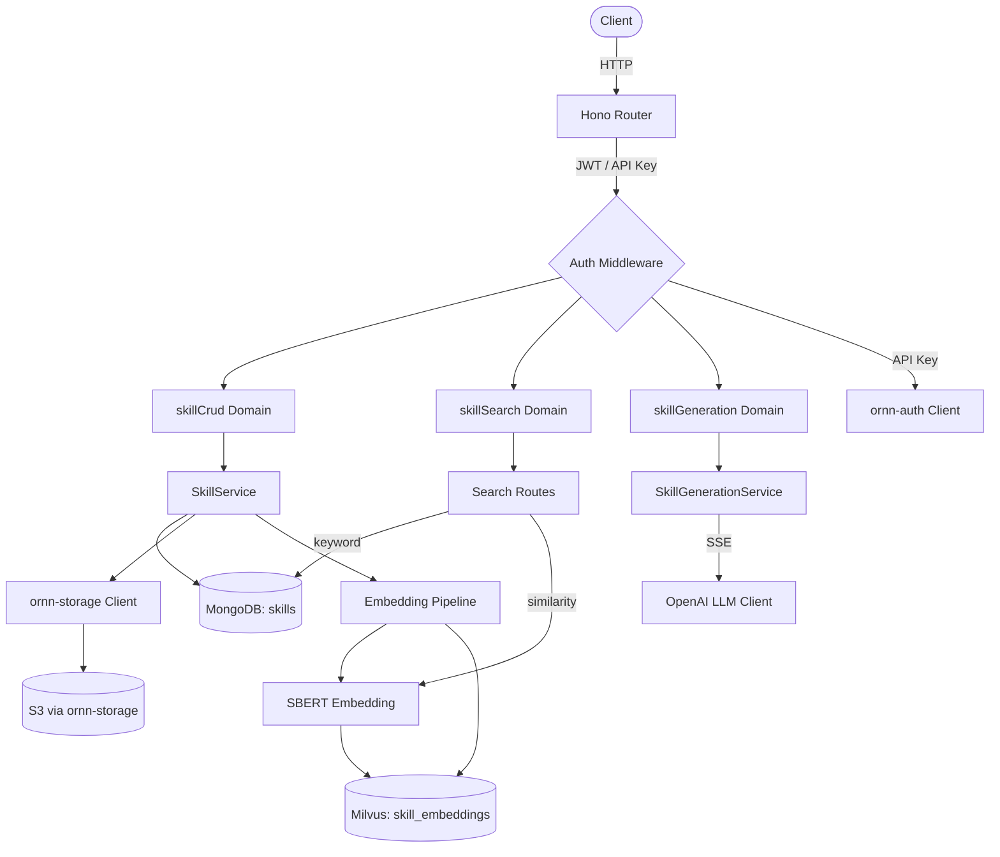

# Requirements -- ornn-skill

## Overview

ornn-skill is the skill management microservice for the Ornn platform. It handles the full lifecycle of skill packages -- creation, retrieval, update, deletion, search (keyword and vector similarity), format validation, and LLM-powered skill generation via SSE streaming. Built on Bun with Hono as the HTTP framework.

## Functional Requirements

### FR-1: Skill CRUD

- FR-1.1: The service shall allow authenticated users to create a skill by uploading a ZIP/tar.gz package containing a valid SKILL.md and optional scripts.
- FR-1.2: On creation, the service shall parse the SKILL.md frontmatter to extract metadata (name, description, category, tags, runtimes, tools, env vars, dependencies).
- FR-1.3: Skill names must be lowercase kebab-case, 1--64 characters, and must not start with a hyphen.
- FR-1.4: The service shall reject creation of a skill with a duplicate name (409 Conflict).
- FR-1.5: The service shall store uploaded packages in S3 via ornn-storage and persist metadata in MongoDB.
- FR-1.6: The service shall allow retrieval of a skill by ID or by name, returning full detail including latest version info.
- FR-1.7: The service shall allow listing skills with pagination support.
- FR-1.8: The service shall allow updating a skill's metadata or package via PUT request.
- FR-1.9: The service shall support soft-deletion of skills, marking them as deleted rather than removing them from the database.
- FR-1.10: On creation, the service shall set ownership of the skill to the creating user and default visibility to private.
- FR-1.11: The service shall support versioning of skill packages -- each upload creates a new version record with file hash, size, and download count.
- FR-1.12: The SKILL.md content (or fallback readmeMd) shall be stored as the version's readme_md field.

### FR-2: Skill Metadata Schema

- FR-2.1: The service shall support a nested metadata structure with fields: `category`, `runtime`, `runtimeDependency`, `runtimeEnvVar`, `toolList`, and `tag`.
- FR-2.2: Valid categories are: `plain`, `tool-based`, `runtime-based`, and `mixed`.
- FR-2.3: When category is `tool-based`, at least one tool in `toolList` is required (conditional validation).
- FR-2.4: When category is `runtime-based`, at least one runtime in `runtime` is required (conditional validation).
- FR-2.5: The service shall support Claude-specific fields: `disableModelInvocation` (default false), `userInvocable` (default true), `allowedTools`, `model`, `context`, `agent`, `argumentHint`, and `hooks`.
- FR-2.6: The service shall accept optional fields: `license`, `compatibility`, and `repoUrl`.

### FR-3: Backward Compatibility (Frontmatter Adapter)

- FR-3.1: The service shall accept old flat frontmatter format with keys `category`, `tools`, `runtimes`, `tags`, `env`, `dependencies` and automatically map them to the nested metadata structure.
- FR-3.2: Old category values shall be mapped: `tools_required` to `tool-based`, `runtime_required` to `runtime-based`, `imported` to `plain`.
- FR-3.3: YAML hyphenated keys (e.g., `disable-model-invocation`) shall be converted to camelCase (e.g., `disableModelInvocation`).
- FR-3.4: The adapter shall support round-trip conversion between camelCase and YAML hyphenated keys.
- FR-3.5: API requests with flat tools/runtimes fields shall be auto-detected as legacy and transformed before validation.

### FR-4: Format Validation

- FR-4.1: `GET /skill-format/rules` shall return the canonical format validation rules as markdown, with anonymous (unauthenticated) access.
- FR-4.2: `POST /skill-format/validate` shall validate an uploaded ZIP against all format rules and return all violations (not fail on first).
- FR-4.3: Validation rules shall check: folder naming, SKILL.md presence and case, frontmatter schema, allowed root items, and metadata constraints.

### FR-5: Embedding Pipeline

- FR-5.1: When a skill is created or updated, the service shall compute a 384-dimensional SBERT embedding from the skill's name and description.
- FR-5.2: The embedding text shall be composed as `"${description} ${readmeMd}"`, truncated to 8192 characters.
- FR-5.3: Embedding computation shall use the local SBERT model (all-MiniLM-L6-v2 via @xenova/transformers ONNX runtime).
- FR-5.4: The SBERT model shall be lazy-loaded on first use and cached as a singleton; concurrent loading calls shall share the same promise.
- FR-5.5: The embedding vector shall be upserted into the Milvus `skill_embeddings` collection (delete-then-insert).
- FR-5.6: Embedding computation shall be fire-and-forget -- failures are logged but do not block the CRUD response.
- FR-5.7: If the embedding text is empty, embedding computation shall be skipped.

### FR-6: Skill Search

- FR-6.1: The search endpoint (`POST /skill-search`) shall accept a query string and return matching skills with match type (substring, exact_name, similarity, none).
- FR-6.2: The search endpoint shall support both JWT authentication (web UI) and API key authentication (ornn-mcp, `sk_` prefix).
- FR-6.3: API key validation shall be performed via HTTP call to ornn-auth with the `X-Internal-Auth` header.
- FR-6.4: The service shall validate that API keys have `sk_` prefix and are at least 32 characters.
- FR-6.5: Revoked API keys shall return 403 Forbidden (error code `API_002`); missing/invalid keys return 401 (error code `API_001`).
- FR-6.6: The search endpoint shall return 400 for empty query strings.

### FR-7: Skill Discovery (MCP)

- FR-7.1: The discovery service shall implement a two-phase search: exact name match first, then similarity fallback.
- FR-7.2: Exact name matches shall return `matchType: "exact_name"` with similarity score 1.0.
- FR-7.3: Similarity matches shall return `matchType: "similarity"` with the actual cosine similarity score.
- FR-7.4: When no matches are found, the service shall return `matchType: "none"` with an empty results array.
- FR-7.5: Similarity results shall be filtered by scope -- private skills owned by other users shall be excluded.
- FR-7.6: The discovery service shall respect a configurable `topK` limit for results.
- FR-7.7: Results shall include MCP-compatible fields: `name`, `description`, `tags`, `similarity`, `isOwn`, `status`, `tools`, `runtimes`, `envVars`, `runtimeDependencies`.
- FR-7.8: When `includePackage` is true, the service shall call SkillPackageReader to load SKILL.md content and files.
- FR-7.9: Discovery response metadata shall include `queryTimeMs`.

### FR-8: Semantic Search Service

- FR-8.1: The semantic search service shall embed the query text and perform ANN search against Milvus, returning results above a configurable similarity threshold (default 0.7).
- FR-8.2: Results shall be sorted by similarity score in descending order.
- FR-8.3: The `maxResults` parameter shall be respected.
- FR-8.4: If the embedding API fails, the service shall fall back to full-text search (FTS) via MongoDB and indicate `fallbackToFts: true`.
- FR-8.5: When zero results are found and an LLM generation service is available, the service may trigger auto-generation.
- FR-8.6: LLM unavailability shall propagate as 503; LLM timeout shall propagate as 504.

### FR-9: Skill Package Reader

- FR-9.1: The package reader shall read the latest version of a skill package by skill ID.
- FR-9.2: If no version exists, the reader shall return null.
- FR-9.3: The reader shall split SKILL.md content into `frontmatter` and `content` sections.
- FR-9.4: If no frontmatter delimiters exist, `frontmatter` shall be empty and all content goes to `content`.
- FR-9.5: SKILL.md shall be excluded from the `files` array.
- FR-9.6: If package extraction fails, the reader shall gracefully degrade -- returning SKILL.md content from the version's readme_md with an empty files array.

### FR-10: Query Deduplication Lock

- FR-10.1: Concurrent identical queries shall be deduplicated -- only one execution occurs and all callers receive the same result.
- FR-10.2: Different keys shall execute independently.
- FR-10.3: After a query completes (success or failure), the key shall be released for re-acquisition.
- FR-10.4: The lock shall support a configurable expiry timeout.

### FR-11: Skill Package Builder

- FR-11.1: The builder shall parse JSON string arrays from form data, returning empty array for invalid input.
- FR-11.2: The builder shall resolve author name from body value, falling back to authenticated user email.
- FR-11.3: The builder shall collect uploaded files from indexed form fields (`file_0`, `file_1`, ...) with optional folder metadata.
- FR-11.4: Files with slashes in their name shall have the folder extracted from the path.
- FR-11.5: File collection shall stop at the first non-File entry.
- FR-11.6: The builder shall create virtual .tar.gz archives from SKILL.md content and uploaded files.

### FR-12: SKILL.md Parser

- FR-12.1: The parser shall extract YAML frontmatter from SKILL.md and map it to a structured `ParsedSkillMd`.
- FR-12.2: The parser shall support the new nested metadata format with fields under `metadata:`.
- FR-12.3: The parser shall support old flat format and auto-map via the frontmatter adapter.
- FR-12.4: Missing optional fields shall have safe defaults: version defaults to "1", category to "plain", arrays to empty.
- FR-12.5: Malformed YAML shall fall back to defaults with the raw text as readmeMd.
- FR-12.6: Tags with non-string values shall be filtered out.
- FR-12.7: Claude-specific fields shall default to: `disableModelInvocation: false`, `userInvocable: true`, empty arrays for `allowedTools` and `context`, null for `model`, `agent`, `hooks`, `argumentHint`.

### FR-13: AI Skill Generation (SSE Streaming)

- FR-13.1: `POST /skills/generate/stream` shall accept a JSON body with a `query` field (1--2000 characters) and stream generation events via SSE.
- FR-13.2: The stream endpoint shall require JWT authentication; missing/invalid tokens return 401.
- FR-13.3: SSE responses shall include headers: `Content-Type: text/event-stream`, `Cache-Control: no-cache`, `X-Accel-Buffering: no`.
- FR-13.4: The stream shall emit events in order: `generation_start`, one or more `token` events, then `generation_complete` (with raw JSON) or `error`.
- FR-13.5: The stream endpoint shall NOT persist generated skills (no auto-persist).
- FR-13.6: An aborted request signal shall cause the stream to emit an `error` event.

### FR-14: Skill Refinement (SSE Streaming)

- FR-14.1: `POST /skills/generate/refine` shall accept a conversation history and an instruction (1--2000 characters) and stream refinement events via SSE.
- FR-14.2: Missing or empty instruction shall return 400.
- FR-14.3: The refinement stream shall emit the same event types as generation: `generation_start`, `token`, `generation_complete`.
- FR-14.4: Refinement shall NOT persist results.
- FR-14.5: Conversation history roles shall only allow "user" and "assistant"; other roles shall fail validation.

### FR-15: Skill Generation Service

- FR-15.1: The `generate` method shall call the LLM with a system prompt constraining output to valid skill JSON.
- FR-15.2: Generated skills shall be limited to `plain` or `runtime-based` categories; `tool-based` and `mixed` are forbidden.
- FR-15.3: LLM output shall be parsed, cleaned of markdown fences, and validated against a Zod schema.
- FR-15.4: Schema validation constraints: `readmeBody` must be 50--20000 characters; missing `scripts` defaults to empty array.
- FR-15.5: If the generated name conflicts with an existing skill, the service shall deduplicate by appending `-2`.
- FR-15.6: If LLM output is invalid JSON, the service shall retry once with stricter instructions before throwing.
- FR-15.7: LLM timeouts shall throw a "timed out" error.
- FR-15.8: The system prompt shall enforce standard skill structure (SKILL.md, scripts/), target Bun runtime, and document the nested metadata schema.
- FR-15.9: Legacy `readmeMd` output from LLM shall be automatically converted to `readmeBody` (stripping frontmatter).

### FR-16: LLM Client

- FR-16.1: The OpenAI LLM client shall support both streaming and non-streaming chat completions.
- FR-16.2: Default parameters: model from config, max_tokens 4096, temperature 0.7.
- FR-16.3: Custom options shall override defaults (model, maxTokens, temperature, timeoutMs).
- FR-16.4: Null content in LLM response choices shall return empty string.
- FR-16.5: API errors shall propagate to callers.
- FR-16.6: Request timeouts shall be cleaned up after completion to prevent timer leaks.

### FR-17: Zod Schema Validation

- FR-17.1: `skillCreateSchema` shall validate name format (kebab-case, max 64 chars), required metadata, and conditional tool/runtime requirements.
- FR-17.2: `skillUpdateSchema` shall accept partial updates (all fields optional).
- FR-17.3: `generateQuerySchema` shall require query (1--2000 characters).
- FR-17.4: `refineSchema` shall require instruction (1--2000 characters) and conversation history with valid roles (user, assistant only).

## Non-Functional Requirements

- NFR-1: The service shall run on the Bun runtime with Hono as the HTTP framework.
- NFR-2: All CRUD and search endpoints shall require authentication (JWT or API key).
- NFR-3: Format rules endpoint (`GET /skill-format/rules`) shall be anonymously accessible.
- NFR-4: The generation domain shall only be mounted when `SKILL_CREATE_LLM_API_KEY` is configured.
- NFR-5: When Milvus is not configured, the service shall use NullEmbeddingRepository for graceful degradation (similarity search returns empty results).
- NFR-6: All repositories and services shall define explicit interfaces for testability via dependency injection.
- NFR-7: File uploads shall be limited to a configurable max size (default 50 MB).
- NFR-8: SSE streams shall include keep-alive heartbeats at a configurable interval (default 15s).
- NFR-9: SBERT embeddings shall be 384-dimensional using the all-MiniLM-L6-v2 model.
- NFR-10: The service shall expose `/health` and `/openapi` endpoints for operational monitoring.

