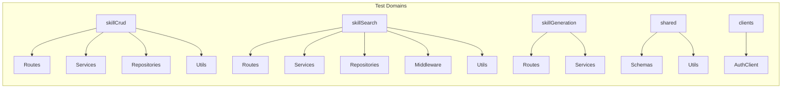

# Test Specification -- ornn-skill

## Overview

ornn-skill uses Bun's built-in test runner (`bun:test`) with mock-based unit testing. All external dependencies (MongoDB, Milvus, ornn-auth, ornn-storage, OpenAI API, SBERT model) are mocked at the interface boundary. Tests are co-located with their source files using the `*.test.ts` naming convention.



## Unit Tests

### clients/authClient

| Test ID | Description | Input | Expected Output |
|---------|------------|-------|-----------------|
| UT-AC-01 | validateApiKey sends POST with key and auth header | Valid API key `sk_testkey` | Returns `{ userId, permissions }`, correct URL and headers sent |
| UT-AC-02 | Returns null for invalid key (data is null) | Key where auth returns `{ data: null }` | Returns `null` |
| UT-AC-03 | Returns null on 401 response | Key triggering 401 | Returns `null` |
| UT-AC-04 | Returns null on 404 response | Key triggering 404 | Returns `null` |
| UT-AC-05 | Throws AppError on 500 response | Key triggering 500 | Throws "Auth service returned 500" |

### domains/skillCrud/routes/skillRoutes

| Test ID | Description | Input | Expected Output |
|---------|------------|-------|-----------------|
| UT-SR-01 | GET /skills returns list | Request to `/api/skills` | 200 with `data` array and `meta.total` |
| UT-SR-02 | GET /skills/:id returns detail | Request to `/api/skills/id-1` | 200 with skill detail object |
| UT-SR-03 | GET /skills/:id returns 404 for missing | Request to `/api/skills/nope` | 404 with error code `SKILL_NOT_FOUND` |
| UT-SR-04 | PUT /skills/:id updates skill | PUT with `{ description: "new desc" }` | 200 with updated description |
| UT-SR-05 | DELETE /skills/:id returns 204 | DELETE `/api/skills/id-1` | 204 No Content |
| UT-SR-06 | DELETE /skills/:id returns 404 for missing | DELETE `/api/skills/nope` | 404 with error code `SKILL_NOT_FOUND` |

### domains/skillCrud/services/skillService

| Test ID | Description | Input | Expected Output |
|---------|------------|-------|-----------------|
| UT-SS-01 | getSkill non-existent throws NotFound | ID `"nonexistent"` | Throws AppError with status 404 |
| UT-SS-02 | getSkill by ID returns detail | Existing skill ID | Returns skill detail with correct name |
| UT-SS-03 | createSkill duplicate name throws Conflict | Name that already exists | Throws AppError with status 409 |
| UT-SS-04 | createSkill valid input creates skill and version | Valid create payload + file | Calls `skillRepo.create`, `versionRepo.create`, `setOwnership`, `setTags`, `searchRepo.indexSkill`, `storageService.savePackage` |
| UT-SS-05 | createSkill with skillMd stores as readme | Payload with `skillMd` field | Version `readmeMd` equals the skillMd content |
| UT-SS-06 | createSkill without skillMd falls back to readmeMd | Payload with `readmeMd` field | Version `readmeMd` equals the readmeMd content |
| UT-SS-07 | createSkill with metadata passes category and tools | Payload with `tool-based` category and tools | `create` called with correct category and tools |
| UT-SS-08 | deleteSkill non-existent throws NotFound | Non-existent ID | Throws AppError with status 404 |
| UT-SS-09 | deleteSkill existing soft-deletes | Existing skill ID | Calls `softDelete` and `searchRepo.removeSkill` |

### domains/skillCrud/services/skillMdParser

| Test ID | Description | Input | Expected Output |
|---------|------------|-------|-----------------|
| UT-SMP-01 | New nested format returns all fields | SKILL.md with nested metadata | Correct name, description, version, license, compatibility, category, arrays |
| UT-SMP-02 | New format with Claude fields parses all | SKILL.md with Claude-specific fields | `disableModelInvocation`, `userInvocable`, `allowedTools`, `model`, `context`, `agent`, `argumentHint`, `hooks` parsed correctly |
| UT-SMP-03 | Old flat format auto-mapped to nested | SKILL.md with `tools_required` category | Category mapped to `tool-based`, tools/tags in metadata |
| UT-SMP-04 | Old flat format with runtimes maps correctly | SKILL.md with `runtime_required` | Category `runtime-based`, runtimes/envVars/dependencies mapped |
| UT-SMP-05 | No frontmatter returns defaults with full content as readme | Plain markdown without `---` delimiters | name null, version "1", category "plain", readmeMd is full content |
| UT-SMP-06 | Missing optional fields returns defaults | Frontmatter with only `name` | description null, version "1", category "plain" |
| UT-SMP-07 | Malformed YAML falls back to defaults | Invalid YAML in frontmatter | name null, readmeMd is raw text |
| UT-SMP-08 | Empty string returns defaults | `""` | name null, version "1", readmeMd `""` |
| UT-SMP-09 | Whitespace only returns defaults | `"   \n  \n  "` | name null, readmeMd `""` |
| UT-SMP-10 | Frontmatter with no body returns empty readme | Frontmatter only, no content after `---` | readmeMd `""` |
| UT-SMP-11 | Tags with non-string values filters non-strings | Tags `["valid", 123, true]` | Only `["valid"]` |
| UT-SMP-12 | No new fields returns empty arrays | Frontmatter with only `name` | tools, runtimes, envVars, runtimeDependencies all `[]` |
| UT-SMP-13 | Non-array new fields returns empty arrays | tools/runtimes/env/dependencies as non-arrays | All return `[]` |
| UT-SMP-14 | Claude field defaults when missing | Frontmatter without Claude fields | disableModelInvocation false, userInvocable true, etc. |

### domains/skillCrud/repositories/skillRepository

| Test ID | Description | Input | Expected Output |
|---------|------------|-------|-----------------|
| UT-REP-01 | create valid data calls insertOne | Skill create data | `insertOne` called, returns skill with ID |
| UT-REP-02 | findById existing returns skill | Existing ID | Returns skill with correct name |
| UT-REP-03 | findById non-existent returns null | Non-existent ID | Returns `null` |
| UT-REP-04 | findByName existing returns skill | Existing name | Returns skill with correct ID |
| UT-REP-05 | findByName non-existent returns null | Non-existent name | Returns `null` |
| UT-REP-06 | softDelete calls updateOne | Valid skill ID | `updateOne` called |
| UT-REP-07 | setTags calls updateOne | ID and tags array | `updateOne` called |
| UT-REP-08 | getTags returns tags from document | ID of skill with tags | Returns sorted tags array |
| UT-REP-09 | findByNameInScope calls find with regex | Name and user ID | `find` called, returns matching skills |
| UT-REP-10 | findByNameInScope no matches returns empty | Non-matching name | Returns `[]` |
| UT-REP-11 | searchByNameSubstring calls find with regex | Substring and user ID | `find` called, returns matching skills |
| UT-REP-12 | searchByNameSubstring no matches returns empty | Non-matching substring | Returns `[]` |

### domains/skillCrud/utils/skillPackageBuilder

| Test ID | Description | Input | Expected Output |
|---------|------------|-------|-----------------|
| UT-SPB-01 | parseJsonStringArray valid JSON array returns array | `'["a","b","c"]'` | `["a", "b", "c"]` |
| UT-SPB-02 | parseJsonStringArray empty array returns empty | `"[]"` | `[]` |
| UT-SPB-03 | parseJsonStringArray invalid JSON returns empty | `"not json"` | `[]` |
| UT-SPB-04 | parseJsonStringArray non-string returns empty | `123`, `undefined`, `null` | `[]` |
| UT-SPB-05 | parseJsonStringArray JSON object returns empty | `'{"key":"val"}'` | `[]` |
| UT-SPB-06 | resolveAuthorName body value present returns body value | `"john"` with auth | `"john"` |
| UT-SPB-07 | resolveAuthorName empty falls back to auth email | `""` with auth | Auth email |
| UT-SPB-08 | resolveAuthorName undefined falls back to auth | `undefined` with auth | Auth email |
| UT-SPB-09 | resolveAuthorName no auth returns undefined | `undefined`, null auth | `undefined` |
| UT-SPB-10 | resolveAuthorName non-string falls back to auth | `42` with auth | Auth email |
| UT-SPB-11 | collectUploadedFiles no files returns empty | `{}` | `[]` |
| UT-SPB-12 | collectUploadedFiles single file collects it | `{ file_0: File }` | Array with 1 entry, folder `""` |
| UT-SPB-13 | collectUploadedFiles with folder meta uses it | `{ file_0: File, file_0_folder: "scripts" }` | folder is `"scripts"` |
| UT-SPB-14 | collectUploadedFiles slash in name extracts folder | File named `"scripts/deploy.ts"` | folder is `"scripts"` |
| UT-SPB-15 | collectUploadedFiles multiple files collects all | 3 indexed files | Array with 3 entries |
| UT-SPB-16 | collectUploadedFiles stops at first non-File | file_0 is File, file_1 is string | Array with 1 entry |
| UT-SPB-17 | buildVirtualArchive creates archive with SKILL.md | Skill name + SKILL.md content, no files | File instance, `.tar.gz` extension, size > 0 |
| UT-SPB-18 | buildVirtualArchive creates archive with files | Skill name + files with folders | File with size > 0 |
| UT-SPB-19 | buildVirtualArchive type is tar.gz | Any input | type `application/gzip`, name contains `.tar.gz` |

### domains/skillSearch/routes/searchRoutes

| Test ID | Description | Input | Expected Output |
|---------|------------|-------|-----------------|
| UT-SRR-01 | POST /skill-search valid request returns 200 | JSON `{ query: "my-skill" }` with auth | 200, `data.total=1`, `matchType="substring"` |
| UT-SRR-02 | POST /skill-search empty query returns 400 | JSON `{ query: "" }` with auth | 400 |
| UT-SRR-03 | POST /skill-search missing auth returns 401 | JSON `{ query: "test" }` without auth | 401 |
| UT-SRR-04 | POST /skill-search no results returns empty | Query with no matches | 200, `data.total=0`, `results=[]` |

### domains/skillSearch/services/embeddingService

| Test ID | Description | Input | Expected Output |
|---------|------------|-------|-----------------|
| UT-ES-01 | embed returns expected vector | Mock returning `[0.1, 0.2, 0.3]` | Returns `[0.1, 0.2, 0.3]` |
| UT-ES-02 | embed called with correct text | `"my query"` | `embed` called with `"my query"` |
| UT-ES-03 | SBERT_MODEL_ID has correct format | -- | `"sbert-all-MiniLM-L6-v2"` |
| UT-ES-04 | SBERT_MODEL_NAME is HuggingFace format | -- | `"Xenova/all-MiniLM-L6-v2"` |
| UT-ES-05 | SBERT_DIMENSIONS is 384 | -- | `384` |

### domains/skillSearch/services/embeddingService (SbertEmbeddingService)

| Test ID | Description | Input | Expected Output |
|---------|------------|-------|-----------------|
| UT-SBERT-01 | SBERT_MODEL_ID has correct value | -- | `"sbert-all-MiniLM-L6-v2"` |
| UT-SBERT-02 | embed lazy-loads pipeline only once | Two sequential embed calls | Mock extractor called twice, pipeline promise resolved once |
| UT-SBERT-03 | embed concurrent calls share same pipeline | Two parallel embed calls | Both return same vector |
| UT-SBERT-04 | embed returns number array not Float32Array | Any input | `Array.isArray(result)` is true |

### domains/skillSearch/services/semanticSearchService

| Test ID | Description | Input | Expected Output |
|---------|------------|-------|-----------------|
| UT-SEM-01 | search returns matches above threshold sorted descending | Query "test" | 2 results, first score ~1.0, `fallbackToFts=false` |
| UT-SEM-02 | search respects maxResults | maxResults=1 | 1 result |
| UT-SEM-03 | search embedding API fails falls back to FTS | Embed throws error | `fallbackToFts=true`, results from FTS |
| UT-SEM-04 | search zero results no generator returns empty | No matches, no generator | 0 results, `generated=false` |
| UT-SEM-05 | search LLM unavailable propagates 503 | Generator throws serviceUnavailable | AppError with statusCode 503 |
| UT-SEM-06 | search LLM timeout propagates 504 | Generator throws gatewayTimeout | AppError with statusCode 504 |

### domains/skillSearch/services/skillDiscoveryService

| Test ID | Description | Input | Expected Output |
|---------|------------|-------|-----------------|
| UT-SD-01 | discover exact name match returns exact_name type | Query matching a skill name | `matchType="exact_name"`, total=1, correct fields |
| UT-SD-02 | discover no exact match falls back to similarity | Query with no exact match but similar skills | `matchType="similarity"`, total=1 |
| UT-SD-03 | discover no matches returns none | Query with no results | `matchType="none"`, total=0 |
| UT-SD-04 | discover similarity filters private skills | Private skill owned by another user | `matchType="none"`, total=0 |
| UT-SD-05 | discover respects topK limit | topK=2, 3 available | total=2, results length=2 |
| UT-SD-06 | discover meta includes queryTimeMs | Any query | `meta.queryTimeMs` is number >= 0 |
| UT-SD-07 | discover result includes MCP-compatible fields | Exact match query | tags, similarity=1.0, isOwn, status, package=undefined |
| UT-SD-08 | discover similarity result includes score | Similarity match | `similarity=0.85` |
| UT-SD-09 | discover includePackage calls package reader | `includePackage: true` | package defined, reader called |
| UT-SD-10 | discover includePackage false does not call reader | `includePackage: false` | package undefined, reader not called |

### domains/skillSearch/services/skillPackageReader

| Test ID | Description | Input | Expected Output |
|---------|------------|-------|-----------------|
| UT-SPR-01 | readPackage no version returns null | Skill ID with no version | `null` |
| UT-SPR-02 | readPackage splits SKILL.md frontmatter | Version with frontmatter readme | `frontmatter` and `content` split correctly |
| UT-SPR-03 | readPackage no frontmatter returns empty frontmatter | Version without `---` delimiters | frontmatter `""`, content is full text |
| UT-SPR-04 | readPackage excludes SKILL.md from files | Extracted package with SKILL.md and run.ts | SKILL.md not in files, run.ts present |
| UT-SPR-05 | readPackage extraction error graceful degradation | Storage extraction throws | Returns skillMd from readme_md, files `[]` |

### domains/skillSearch/repositories/embeddingRepository

| Test ID | Description | Input | Expected Output |
|---------|------------|-------|-----------------|
| UT-ER-01 | upsert calls Milvus insert after delete | Skill ID and embedding vector | `client.delete` and `client.insert` called |
| UT-ER-02 | searchSimilar returns scored results | Query vector, topK, threshold | Array with `{ skillId, score }` entries |
| UT-ER-03 | remove calls Milvus delete | Skill ID | `client.delete` called |
| UT-ER-04 | NullEmbeddingRepository searchSimilar returns empty | Any input | `[]` |
| UT-ER-05 | NullEmbeddingRepository findBySkillId returns null | Any ID | `null` |
| UT-ER-06 | NullEmbeddingRepository upsert does not throw | Any input | No exception |
| UT-ER-07 | NullEmbeddingRepository remove does not throw | Any ID | No exception |

### domains/skillSearch/middleware/apiKeyMiddleware

| Test ID | Description | Input | Expected Output |
|---------|------------|-------|-----------------|
| UT-AKM-01 | No auth header returns 401 | Request without Authorization header | 401, error code `API_001` |
| UT-AKM-02 | Invalid format returns 401 | `Authorization: Basic abc123` | 401, error code `API_001` |
| UT-AKM-03 | Invalid key returns 401 | Bearer token with invalid key | 401, error code `API_001` |
| UT-AKM-04 | Revoked key returns 403 | Valid format key with `status: "revoked"` | 403, error code `API_002` |
| UT-AKM-05 | Valid key sets context | Valid active key | 200, `userId` in response body |
| UT-AKM-06 | getApiKeyUser no context throws error | Context without apiKeyUser | Throws error |
| UT-AKM-07 | getApiKeyUser has context returns info | Context with valid apiKeyUser | Returns user info object |

### domains/skillSearch/utils/queryLock

| Test ID | Description | Input | Expected Output |
|---------|------------|-------|-----------------|
| UT-QL-01 | acquire new key executes function | New key | Returns function result |
| UT-QL-02 | acquire same key deduplicates concurrent calls | Same key, two concurrent calls | Function called once, both get same result |
| UT-QL-03 | acquire after resolve key is released | Sequential acquire of same key | Second acquire executes new function |
| UT-QL-04 | acquire fn throws key is released | Key with throwing function | Key released, can re-acquire |
| UT-QL-05 | isLocked during execution returns true | Key mid-execution | `isLocked` returns true, then false after completion |
| UT-QL-06 | acquire timer cleared on resolve no leaks | Short expiry lock | Re-acquisition after expiry works cleanly |
| UT-QL-07 | acquire different keys run independently | Keys "a" and "b" concurrently | Both execute, count=2 |

### domains/skillGeneration/routes/skillGenerateRoutes

| Test ID | Description | Input | Expected Output |
|---------|------------|-------|-----------------|
| UT-SGR-01 | stream no auth header returns 401 | POST without Authorization | 401 |
| UT-SGR-02 | refine no auth header returns 401 | POST without Authorization | 401 |
| UT-SGR-03 | stream invalid token returns 401 | POST with invalid Bearer token | 401 |
| UT-SGR-04 | stream malformed auth header returns 401 | `Authorization: Basic abc123` | 401 |
| UT-SGR-05 | stream valid query returns 200 SSE | JSON `{ query: "Create a PDF parser" }` | 200, Content-Type `text/event-stream` |
| UT-SGR-06 | stream missing query returns 400 | JSON `{}` | 400 |
| UT-SGR-07 | stream empty query returns 400 | JSON `{ query: "" }` | 400 |
| UT-SGR-08 | stream query too long returns 400 | Query 2001 chars | 400 |
| UT-SGR-09 | stream sets correct SSE headers | Valid request | `Cache-Control: no-cache`, `X-Accel-Buffering: no` |
| UT-SGR-10 | stream calls generateStreamDirect | Valid request | `generateStreamDirect` called |
| UT-SGR-11 | refine valid input returns 200 SSE | Conversation history + instruction | 200, Content-Type `text/event-stream` |
| UT-SGR-12 | refine missing instruction returns 400 | Missing instruction field | 400 |
| UT-SGR-13 | refine empty instruction returns 400 | Empty instruction string | 400 |
| UT-SGR-14 | refine calls generateRefinementStream | Valid refinement request | `generateRefinementStream` called |

### domains/skillGeneration/services/skillGenerationService

| Test ID | Description | Input | Expected Output |
|---------|------------|-------|-----------------|
| UT-SGS-01 | generate valid output creates skill | Prompt "parse PDF tables" | Returns generated skill with correct fields, creates skill + version + search index |
| UT-SGS-02 | generate name conflict deduplicates | Existing skill with same name | Result name has `-2` suffix |
| UT-SGS-03 | generate invalid LLM output retries then throws | LLM returns non-JSON | Throws "invalid output after retry" |
| UT-SGS-04 | generate LLM timeout throws gateway timeout | LLM throws abort error | Throws "timed out" |
| UT-SGS-05 | generate passes system prompt to LLM | Any prompt | LLM called with systemPrompt containing "skill generator" |
| UT-SGS-06 | generatedSkillSchema valid data passes | Valid skill JSON | `safeParse.success=true` |
| UT-SGS-07 | generatedSkillSchema invalid category fails | Category "tool-based" | `safeParse.success=false` |
| UT-SGS-08 | generatedSkillSchema missing scripts defaults to empty | No scripts field | scripts defaults to `[]` |
| UT-SGS-09 | generatedSkillSchema readmeBody max 20000 | 20001 chars | `safeParse.success=false` |
| UT-SGS-10 | generatedSkillSchema readmeBody min 50 | "too short" | `safeParse.success=false` |

### domains/skillGeneration/services/skillGenerationService (streaming)

| Test ID | Description | Input | Expected Output |
|---------|------------|-------|-----------------|
| UT-SGSS-01 | generateStreamDirect emits generation_start | Any query | First event `{ type: "generation_start" }` |
| UT-SGSS-02 | generateStreamDirect emits token events | Any query | At least one token event |
| UT-SGSS-03 | generateStreamDirect emits generation_complete | Any query | Complete event with `raw` field |
| UT-SGSS-04 | generateStreamDirect does not persist | Any query | No `persist_complete`, `skillRepo.create` not called |
| UT-SGSS-05 | generateStreamDirect aborted signal emits error | Aborted AbortController | Error event emitted |
| UT-SGSS-06 | generateRefinementStream emits generation_start | History + instruction | First event `{ type: "generation_start" }` |
| UT-SGSS-07 | generateRefinementStream emits generation_complete | History + instruction | Complete event present |
| UT-SGSS-08 | generateRefinementStream does not persist | Any input | `skillRepo.create` and `versionRepo.create` not called |

### domains/skillGeneration/services/skillGenerationService (parseAndValidate)

| Test ID | Description | Input | Expected Output |
|---------|------------|-------|-----------------|
| UT-PAV-01 | valid JSON returns parsed skill | Valid LLM output JSON | Parsed object with name, readmeBody, scripts |
| UT-PAV-02 | JSON with markdown fences cleans and parses | `` ```json\n{...}\n``` `` | Successfully parsed |
| UT-PAV-03 | invalid JSON returns null | `"not json"` | `null` |
| UT-PAV-04 | legacy readmeMd converted to readmeBody | JSON with `readmeMd` instead of `readmeBody` | `readmeBody` contains content without frontmatter |

### domains/skillGeneration/services/promptTemplates

| Test ID | Description | Input | Expected Output |
|---------|------------|-------|-----------------|
| UT-PT-01 | buildDirectGenerationPrompt returns system and user prompts | Any query | Both strings defined |
| UT-PT-02 | user prompt contains query | Specific query string | `userPrompt` contains the query |
| UT-PT-03 | system prompt forbids tool-based category | -- | Contains "plain", "runtime-based", and "never" |
| UT-PT-04 | system prompt enforces standard skill structure | -- | Contains "SKILL.md" and "scripts/" |
| UT-PT-05 | system prompt requires env field | -- | Contains "env" |
| UT-PT-06 | system prompt documents nested metadata schema | -- | Contains "metadata:", "runtime-dependency", "runtime-env-var" |
| UT-PT-07 | system prompt targets Bun runtime | -- | Contains "typescript-bun" |
| UT-PT-08 | buildRefinementPrompt returns system and user prompts | History + instruction | Both strings defined |
| UT-PT-09 | refinement user prompt contains conversation history | History with messages | Contains history content |
| UT-PT-10 | refinement user prompt contains new instruction | Instruction string | Contains the instruction |
| UT-PT-11 | refinement system prompt same constraints as direct | -- | Contains "plain" and "runtime-based" |
| UT-PT-12 | refinement with empty history still works | `[]` + instruction | Contains instruction |
| UT-PT-13 | DIRECT_GENERATION_SYSTEM_PROMPT is non-empty | -- | Length > 100 |
| UT-PT-14 | DIRECT_GENERATION_SYSTEM_PROMPT contains JSON format | -- | Contains "JSON" |
| UT-PT-15 | DIRECT_GENERATION_SYSTEM_PROMPT contains SKILL.md template | -- | Contains "SKILL.md" |

### domains/skillGeneration/services/llmClient (interface mock)

| Test ID | Description | Input | Expected Output |
|---------|------------|-------|-----------------|
| UT-LCM-01 | complete returns expected response | Prompt string | Returns mock response string |
| UT-LCM-02 | complete called with prompt | `"hello"` | `complete` called with `"hello"` |

### domains/skillGeneration/services/llmClient (OpenAILlmClient)

| Test ID | Description | Input | Expected Output |
|---------|------------|-------|-----------------|
| UT-OAI-01 | complete valid prompt returns content | `"hello"` | Returns `"response text"` |
| UT-OAI-02 | complete passes correct default params | `"test prompt"` | Model `gpt-4o`, max_tokens 4096, temperature 0.7 |
| UT-OAI-03 | complete custom options overrides defaults | Custom model/maxTokens/temperature/timeout | Correct params sent, signal present |
| UT-OAI-04 | complete empty choices returns empty string | Response with `content: null` | Returns `""` |
| UT-OAI-05 | complete API error propagates | SDK throws error | Throws "Service unavailable" |
| UT-OAI-06 | complete clears timeout after completion | Timeout option | Completes successfully |

### shared/types/schemas

| Test ID | Description | Input | Expected Output |
|---------|------------|-------|-----------------|
| UT-SCH-01 | skillCreateSchema authorName optional defaults undefined | Base valid object | `authorName` is undefined |
| UT-SCH-02 | skillCreateSchema authorName provided passes through | With `authorName: "test-author"` | Value preserved |
| UT-SCH-03 | skillCreateSchema version optional defaults to "1" | Base valid object | `version` is `"1"` |
| UT-SCH-04 | skillCreateSchema version provided uses value | With `version: "2"` | `version` is `"2"` |
| UT-SCH-05 | skillCreateSchema metadata toolList with tool-based passes | tool-based + toolList | success=true |
| UT-SCH-06 | skillCreateSchema metadata runtime with runtime-based passes | runtime-based + runtime | success=true |
| UT-SCH-07 | skillCreateSchema tool-based missing tools fails | tool-based without toolList | success=false |
| UT-SCH-08 | skillCreateSchema skillMd optional | With skillMd field | success=true |
| UT-SCH-09 | skillCreateSchema repoUrl optional backward compat | With repoUrl | success=true |
| UT-SCH-10 | skillCreateSchema invalid name format fails | `"Invalid Name"` (spaces) | success=false |
| UT-SCH-11 | skillCreateSchema name starts with hyphen fails | `"-invalid"` | success=false |
| UT-SCH-12 | skillCreateSchema name max 64 chars | 65 chars | success=false |
| UT-SCH-13 | skillCreateSchema Claude fields defaults | Base valid object | disableModelInvocation=false, userInvocable=true |
| UT-SCH-14 | skillCreateSchema license optional passes | With `license: "MIT"` | success=true |
| UT-SCH-15 | skillCreateSchema compatibility optional passes | With `compatibility` | success=true |
| UT-SCH-16 | skillUpdateSchema empty object passes | `{}` | success=true |
| UT-SCH-17 | skillUpdateSchema metadata optional passes | With metadata | success=true |
| UT-SCH-18 | skillUpdateSchema Claude fields optional passes | With Claude fields | success=true |
| UT-SCH-19 | generateQuerySchema valid query passes | `{ query: "Create..." }` | success=true |
| UT-SCH-20 | generateQuerySchema empty query fails | `{ query: "" }` | success=false |
| UT-SCH-21 | generateQuerySchema query too long fails | 2001 chars | success=false |
| UT-SCH-22 | generateQuerySchema missing query fails | `{}` | success=false |
| UT-SCH-23 | refineSchema valid input passes | History + instruction | success=true |
| UT-SCH-24 | refineSchema empty instruction fails | `instruction: ""` | success=false |
| UT-SCH-25 | refineSchema invalid role fails | Role "system" | success=false |
| UT-SCH-26 | refineSchema instruction too long fails | 2001 chars | success=false |
| UT-SCH-27 | refineSchema empty conversation history passes | `[]` + instruction | success=true |

### shared/utils/frontmatterAdapter

| Test ID | Description | Input | Expected Output |
|---------|------------|-------|-----------------|
| UT-FA-01 | mapOldCategory tools_required maps to tool-based | `"tools_required"` | `"tool-based"` |
| UT-FA-02 | mapOldCategory runtime_required maps to runtime-based | `"runtime_required"` | `"runtime-based"` |
| UT-FA-03 | mapOldCategory imported maps to plain | `"imported"` | `"plain"` |
| UT-FA-04 | mapOldCategory new values pass through | `"plain"`, `"mixed"`, `"tool-based"`, `"runtime-based"` | Same value |
| UT-FA-05 | mapOldCategory undefined defaults to plain | `undefined` or `""` | `"plain"` |
| UT-FA-06 | adaptOldFrontmatter already nested passes through | Object with `metadata` key | Same object |
| UT-FA-07 | adaptOldFrontmatter flat maps to nested | Flat tools/tags/env/deps | Nested metadata with correct mappings, flat keys removed |
| UT-FA-08 | adaptOldFrontmatter runtimeDependencies alternate key | `runtimeDependencies` field | Mapped to `metadata.runtimeDependency` |
| UT-FA-09 | adaptOldFrontmatter envVars alternate key | `envVars` field | Mapped to `metadata.runtimeEnvVar` |
| UT-FA-10 | adaptOldFrontmatter no category defaults to plain | No category field | `metadata.category="plain"` |
| UT-FA-11 | adaptOldFrontmatter missing arrays default to empty | Only name and category | All arrays `[]` |
| UT-FA-12 | adaptApiRequest new shape with metadata returns as-is | Object with `metadata` | `isLegacy=false`, unchanged |
| UT-FA-13 | adaptApiRequest old shape with flat tools transforms | Flat `tools` field | `isLegacy=true`, `metadata.toolList` set |
| UT-FA-14 | adaptApiRequest old shape with flat runtimes transforms | Flat `runtimes` field | `isLegacy=true`, `metadata.runtime` set |
| UT-FA-15 | adaptApiRequest no tools/runtimes/metadata not legacy | Only name/desc | `isLegacy=false`, unchanged |
| UT-FA-16 | yamlKeysToCamel maps hyphenated to camelCase | Hyphenated keys | camelCase equivalents |
| UT-FA-17 | yamlKeysToCamel maps nested metadata keys | Nested hyphenated metadata | camelCase metadata keys |
| UT-FA-18 | yamlKeysToCamel non-mapped keys pass through | `name`, `description` | Same keys |
| UT-FA-19 | camelKeysToYaml maps camelCase to hyphenated | camelCase keys | Hyphenated equivalents |
| UT-FA-20 | camelKeysToYaml maps nested metadata keys | camelCase metadata | Hyphenated metadata keys |

### shared/utils/embedding

| Test ID | Description | Input | Expected Output |
|---------|------------|-------|-----------------|
| UT-EMB-01 | computeSkillEmbedding valid input calls embed and upsert | Description + readme | `embed` called with concatenated text, `upsert` called |
| UT-EMB-02 | computeSkillEmbedding empty text skips embedding | Empty description and readme | `embed` and `upsert` not called |
| UT-EMB-03 | computeSkillEmbedding embed failure does not throw | Embed throws error | Upsert not called, no exception |
| UT-EMB-04 | computeSkillEmbedding concatenates description and readmeMd | Description + readme | `embed` called with `"desc readme"` |

### shared/utils/frontmatter

| Test ID | Description | Input | Expected Output |
|---------|------------|-------|-----------------|
| UT-FM-01 | extractFrontmatter new nested format returns parsed | SKILL.md with nested metadata | Object with name, description, metadata |
| UT-FM-02 | extractFrontmatter old flat format auto-mapped | SKILL.md with flat tools/tags | Object with nested metadata |
| UT-FM-03 | extractFrontmatter no frontmatter returns null | Plain markdown | `null` |
| UT-FM-04 | extractFrontmatter invalid YAML returns null | Malformed YAML | `null` |
| UT-FM-05 | extractFrontmatter empty frontmatter returns null | `---\n\n---` | `null` |
| UT-FM-06 | extractFrontmatter hyphenated keys mapped to camelCase | `disable-model-invocation`, etc. | `disableModelInvocation`, etc. |
| UT-FM-07 | validateFrontmatter valid new format no errors | Valid object | `valid=true`, `errors=[]` |
| UT-FM-08 | validateFrontmatter valid old flat format auto-mapped | Old flat format | `valid=true` |
| UT-FM-09 | validateFrontmatter missing name returns error | No name field | `valid=false`, error on `"name"` |
| UT-FM-10 | validateFrontmatter missing description returns error | No description field | `valid=false`, error on `"description"` |
| UT-FM-11 | validateFrontmatter missing metadata defaults to plain | No metadata, no flat fields | `valid=true`, category `"plain"` |
| UT-FM-12 | validateFrontmatter conditional violation returns field path | runtime-based without runtime | `valid=false`, error on `"metadata.runtime"` |

## Test Infrastructure

- **Test Runner**: Bun's built-in test runner (`bun:test`)
- **Mocking**: `mock()` from `bun:test` for function/method mocking
- **HTTP Testing**: Hono's `app.request()` for in-process HTTP testing (no network)
- **Logger**: Silent pino logger (`level: "silent"`) to suppress logs in tests
- **Error Handler**: ornn-shared `createErrorHandler` applied to test apps for consistent error responses
- **Pattern**: All dependencies are injected via interfaces, enabling clean mock substitution
