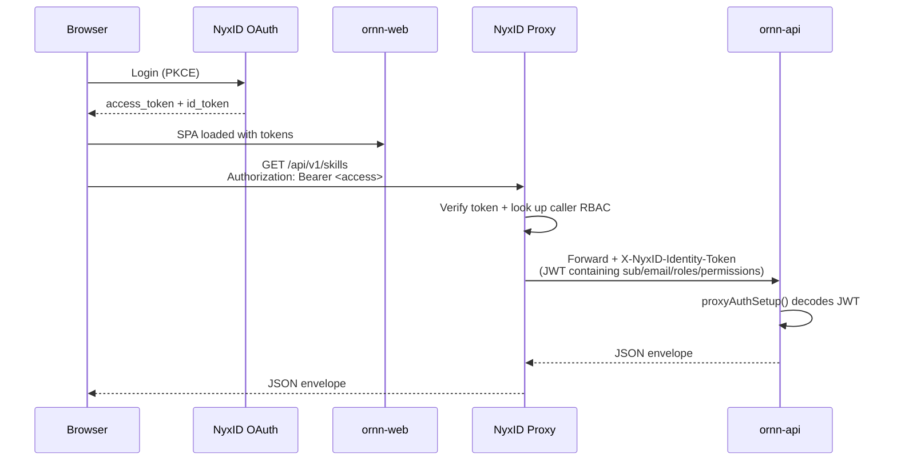
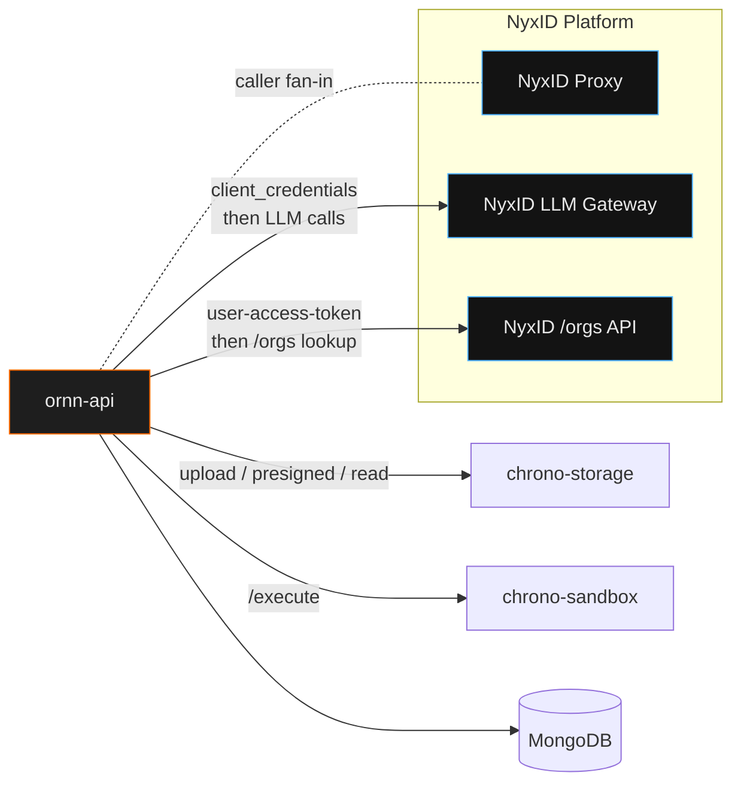

# External Integrations

Ornn relies on three external platforms to do its job: **NyxID** for identity and LLM access, **chrono-storage** for skill package binaries, and **chrono-sandbox** for runtime skill execution. This page explains how each is wired, what contract Ornn expects, and how to reason about failures at each seam.

## 1. NyxID — identity, proxy, and LLM Gateway

NyxID is the most pervasive integration. It appears in front of every authenticated Ornn call and behind every LLM call.

### 1.1 Three roles NyxID plays

| Role | What it does for Ornn |
|------|----------------------|
| **OAuth authority** | Issues access and identity tokens for browser users (PKCE flow) and for the `ornn-api` service account (client_credentials flow) |
| **API proxy** | Fronts every authenticated request to `/api/v1/*`; verifies the caller's token, injects `X-NyxID-Identity-Token`, and forwards to `ornn-api` |
| **LLM Gateway** | Unified OpenAI-style `/v1/responses` endpoint that routes to OpenAI / Anthropic / Google / DeepSeek based on model prefix |

### 1.2 Identity flow (user → browser → NyxID → ornn-api)



Two token contracts matter to `ornn-api`:

| Header | Shape | Used for |
|--------|-------|----------|
| `X-NyxID-Identity-Token` | JWT signed by NyxID (already verified by proxy) | Primary source of truth for caller identity. `sub`, `email`, `name`, `roles`, `permissions` |
| `Authorization: Bearer <user-access-token>` | User's original OAuth access token (forwarded when NyxID user-service config has `forward_access_token: true`) | Only used to call NyxID `/orgs` on the caller's behalf (see §1.4) |

Ornn **never** verifies JWT signatures itself — NyxID has already done so. Decoding without verification is safe in this deployment posture because the only path into `ornn-api` is the NyxID proxy.

### 1.3 Service-account auth (backend → NyxID)

`ornn-api` also needs its own identity for calls that are **not** caller-scoped: fetching the LLM Gateway, pushing audit events, etc.

It uses **OAuth client_credentials**:

| Env var | Meaning |
|---------|---------|
| `NYXID_SA_TOKEN_URL` | `POST` endpoint for client_credentials |
| `NYXID_SA_CLIENT_ID` | Confidential client id |
| `NYXID_SA_CLIENT_SECRET` | Confidential client secret |

The token is cached in-process and refreshed shortly before expiry; the provider is in `clients/nyxid/base.ts`. SA tokens and user OAuth tokens are kept rigorously separate — the codebase's env var naming (`SA_*` vs `OAUTH_*`) reflects that.

### 1.4 Per-user org lookup

`GET /api/v1/me/orgs` asks NyxID which organizations the caller is a member of. Ornn uses this for scope-aware queries (e.g. "show me skills shared with any org I'm in").

Key detail: the lookup hits NyxID **on the caller's behalf**, using the forwarded `Authorization: Bearer <access>`. If NyxID's user-service configuration doesn't have `forward_access_token: true`, the header is stripped on the way in, `auth.userAccessToken` stays `undefined`, and org lookups fail-soft to an empty array. Symptom: `/me/orgs` returns `{ items: [] }` with `duration: 0` in the log and no NyxID roundtrip.

`nyxidOrgLookupMiddleware` caches the result per-request so multiple routes that call `readUserOrgMemberships` within a single request share one NyxID roundtrip.

### 1.5 CSRF on unsafe methods

NyxID's proxy runs a CSRF middleware that inspects the `Origin` header on **unsafe** HTTP methods (POST / PUT / PATCH / DELETE). If the origin isn't in NyxID's `allowed_origins`, the proxy rejects with `403 Forbidden: Cross-site request blocked` **before** the request reaches `ornn-api`.

Safe methods (GET / HEAD / OPTIONS) are not checked. This is why read-only calls from `ornn.chrono-ai.fun` always succeed but write calls may 403 with that origin — the workaround is on the NyxID side (add the origin to the allow-list), not in Ornn.

### 1.6 LLM Gateway

The gateway is NyxID's unified OpenAI-style endpoint. Ornn uses it for:

- Semantic search re-ranking (`skill-search?mode=semantic`)
- Skill generation (all three `/skills/generate*` variants)
- Playground chat (`/playground/chat`)
- Audit LLM analysis (`skill audit` pipeline)

Contract quirks worth remembering:

- **Responses API**, not Chat Completions: `/v1/responses`, body uses `input` (not `messages`), system role is `developer` (not `system`), max tokens is `max_output_tokens` (not `max_tokens`).
- Model routing by prefix:

  | Model prefix | Upstream |
  |--------------|----------|
  | `gpt-*`, `o1-*`, `o3-*`, `o4-*` | OpenAI |
  | `claude-*` | Anthropic |
  | `gemini-*` | Google |
  | `deepseek-*` | DeepSeek |

- Streaming uses SSE; the gateway forwards the upstream provider's token stream unchanged so Ornn only needs one consumer (see the playground flow on the System Architecture page).
- Per-user routing: when an authenticated request forwards the user's access token, the gateway picks the user's personal provider credentials. For service-account calls (audit, background jobs), the gateway uses platform credentials.

## 2. chrono-storage — skill package storage

chrono-storage is an S3-compatible object storage service run inside the chrono platform. Ornn uses it as the sole home for skill package binaries (ZIPs) and for playground-generated output files.

### 2.1 Why object storage and not Mongo

Skill packages can be up to `MAX_PACKAGE_SIZE_BYTES` (default 50 MiB) and are read/written in bulk. BSON would be the wrong tool: inflated on-the-wire size, no range reads, awkward for presigned distribution. chrono-storage is purpose-built for this.

### 2.2 Operations Ornn performs

| Operation | Trigger |
|-----------|---------|
| `PUT <storageKey>` | `POST /api/v1/skills` (create), `PUT /api/v1/skills/:id` with ZIP body (new version), `POST /api/v1/skills/pull` (GitHub import) |
| `GET presigned <storageKey>` | `GET /api/v1/skills/:idOrName` returns `presignedPackageUrl` (caller downloads directly) |
| `GET <storageKey>` | Backend-side reads — mostly the audit engine and the `/skills/:idOrName/json` unpacker |
| `DELETE <storageKey>` | `DELETE /api/v1/skills/:id` — hard-delete |

Naming: `storageKey` is an opaque per-version id assigned on upload. The same skill's different versions get different keys; a redeploy never rewrites a historical version's bytes.

### 2.3 Failure surfaces

The storage client is in `clients/storageClient.ts`. If storage is unreachable:

- Uploads return `503` (retry-safe — if the underlying object is already present, the repo insert will be idempotent via version-level uniqueness).
- Downloads for `/skills/:idOrName/json` surface the storage error directly; the caller sees a 500 and should retry.
- The presigned-URL path is most resilient — Ornn mints the URL at request time, so a transient storage blip doesn't break an in-flight skill detail page.

### 2.4 Configuration

| Env var | Purpose |
|---------|---------|
| `STORAGE_SERVICE_URL` | chrono-storage base URL (via NyxID proxy in production) |
| `STORAGE_BUCKET` | Bucket name for skill packages |

Authentication is via the SA token (§1.3) — the storage service is itself a NyxID-proxied service.

## 3. chrono-sandbox — runtime execution

chrono-sandbox executes user-provided scripts in isolated containers. It is Ornn's escape hatch for runtime skills: the LLM cannot reliably execute `node` or `python` in its own process, so the playground dispatches to the sandbox.

### 3.1 Supported runtimes

| Runtime | Version | Package manager | Script extension |
|---------|---------|-----------------|------------------|
| Node.js | 20.x | npm | `.js`, `.mjs` |
| Python | 3.12 | pip | `.py` |

Other runtimes are out of scope — skill frontmatter enforces this at validation time.

### 3.2 Call shape

```http
POST /execute
Content-Type: application/json

{
  "runtime": "node",
  "entrypoint": "scripts/main.js",
  "files": { "scripts/main.js": "console.log('hi')" },
  "dependencies": ["axios@1.6.0"],
  "envVars": { "API_KEY": "..." },
  "timeout": 30000
}
```

Response:

```json
{ "exitCode": 0, "stdout": "...", "stderr": "", "files": [] }
```

For `output-type: "file"` skills, `files[]` carries base64-encoded artifacts. `ornn-api` re-uploads those artifacts to chrono-storage and rewrites the playground event to include presigned URLs, so the caller only ever sees URLs (never raw bytes).

### 3.3 Security posture

Each invocation is a fresh container with:

- No host filesystem access
- Restricted outbound network (per-deployment policy)
- CPU + memory quotas
- Hard execution timeout (`timeout` param, default 60s, capped at the deployment's max — often 600s)
- Env vars injected per-call; never persisted

This means: a malicious skill in the playground cannot exfiltrate data from another user's session, and cannot persist state across runs. It also means: skills are stateless. If your skill needs persistent state, it has to call out to a real backend of its own — Ornn will not give it one.

### 3.4 Configuration

| Env var | Purpose |
|---------|---------|
| `SANDBOX_SERVICE_URL` | chrono-sandbox base URL (via NyxID proxy in production) |

Like chrono-storage, the sandbox is itself a NyxID-proxied service and auths via the SA token.

## 4. Wiring diagram

Putting it all together, here's the dependency map seen from `ornn-api`'s perspective:



`ornn-api` is the only node in this graph that holds credentials. The web frontend and the CLI agents both rely on NyxID to introduce them — they never see a storage key, a sandbox URL, or an LLM-provider key directly.

## 5. Failure-mode playbook

A reference for when something is off and you need to know which seam to suspect.

| Symptom | Likely seam | First thing to check |
|---------|-------------|----------------------|
| 401 `AUTH_MISSING` on every call | User's browser session expired | Re-login; refresh token path |
| 403 `FORBIDDEN` with `"Missing permission: ornn:<…>"` | Identity token doesn't include the permission | NyxID role assignment; `nyxid whoami` output |
| 403 `"Cross-site request blocked"` on writes | NyxID CSRF middleware | Origin not in NyxID `allowed_origins` |
| `GET /me/orgs` returns `{ items: [] }` with `duration: 0` | NyxID proxy stripped the `Authorization` header | User-service setting `forward_access_token: true` |
| Playground chat opens then hangs | LLM Gateway | NyxID LLM logs; model prefix routing |
| Upload succeeds but later fetch is 5xx | chrono-storage | Storage bucket reachability, key mismatch |
| Playground script run times out | chrono-sandbox | Sandbox timeout envelope; dependency install time |
| 502 on `/api/v1/*` from the browser | nginx upstream TLS | Missing `proxy_ssl_server_name on` / Host alignment for Cloudflare-fronted NyxID |
| No `/v1/` routes hit | Code deployed pre-`/api/v1/` cut | Confirm image tag; `/api/v1/openapi.json` should 200 |

Knowing the seam narrows the log targets to a single service. Every log line carries `requestId`, so once you have the correlation id from the envelope's `X-Request-ID` header, `kubectl logs` with `grep <requestId>` closes the loop in seconds.
