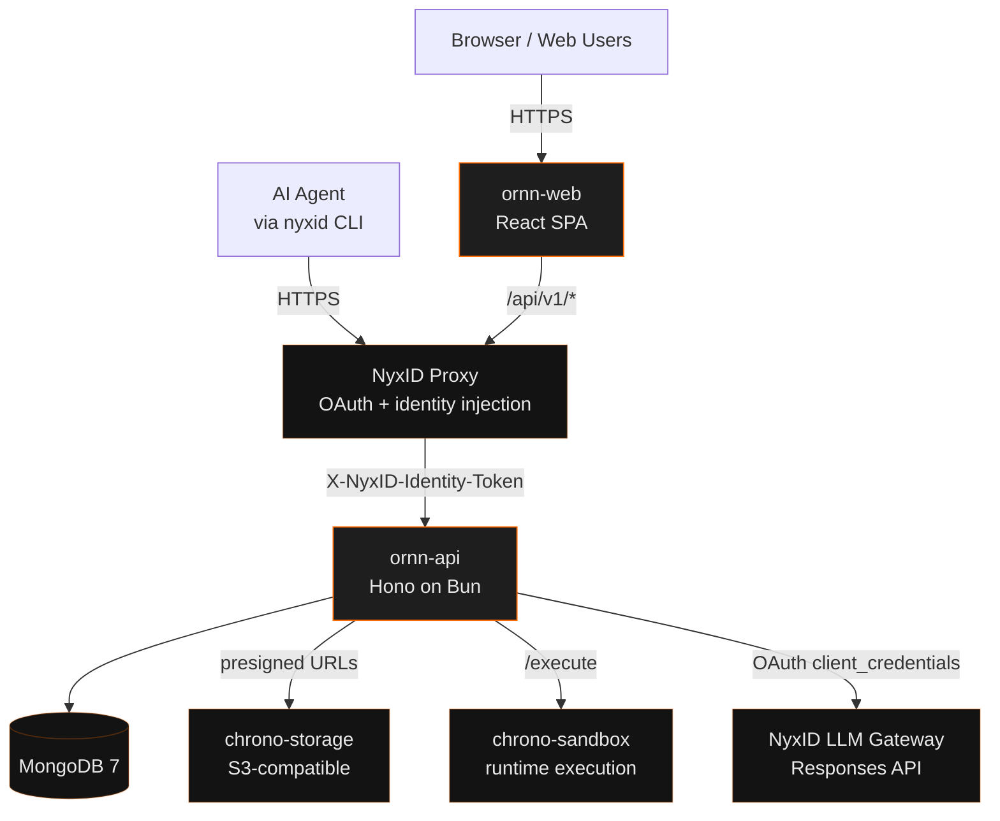
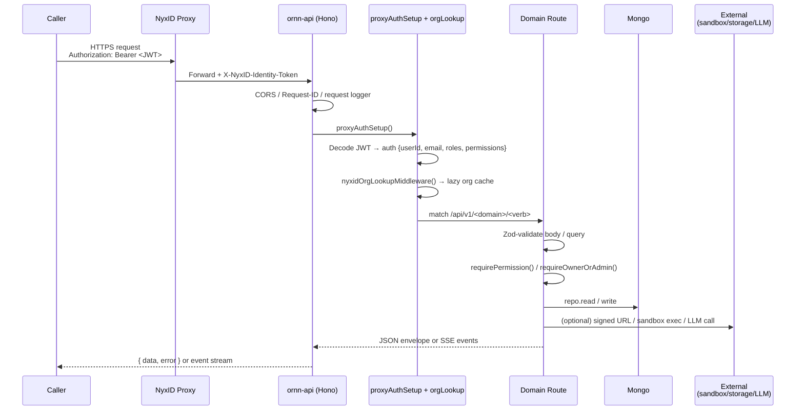
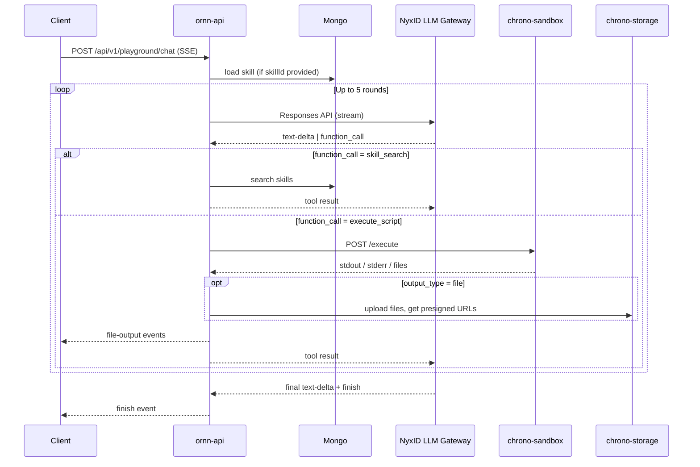

# System Architecture

A reader-friendly map of the Ornn platform: the two services we own, the data we store, and the request paths that knit them together. For integration with NyxID / chrono-sandbox / chrono-storage, see the **External Integrations** page.

## 1. Two services, one platform

The chrono-ornn repository ships **two** deployable services:

| Package | Role | Stack |
|---------|------|-------|
| `ornn-api` | HTTP API backend | TypeScript · Hono · Bun · MongoDB · Pino · Zod |
| `ornn-web` | Single-page web app | TypeScript · React 19 · Vite · Zustand · TanStack Query · Tailwind CSS 4 |

Both packages live in a Bun workspace. The frontend talks to the backend through a single versioned path: `/api/v1/*`.



Every request from a browser or an agent-side CLI flows through the **NyxID proxy**. NyxID authenticates the caller, injects an `X-NyxID-Identity-Token` header (a short-lived JWT with the user's id, email, roles, and permissions), and forwards to `ornn-api`. No other path reaches the backend in production.

## 2. Backend: `ornn-api`

### 2.1 Layout

```
ornn-api/src/
├── index.ts                    Entrypoint
├── bootstrap.ts                Dependency wiring + middleware registration
├── middleware/
│   └── nyxidAuth.ts            Identity-token decode, permission + ownership guards
├── domains/
│   ├── skills/
│   │   ├── crud/               Upload, read, update, delete, permissions, pull-from-github
│   │   ├── search/             Keyword + semantic search, counts
│   │   ├── generation/         AI-assisted generation from prompt / source / OpenAPI (SSE)
│   │   ├── format/             Format rules + ZIP validation
│   │   └── audit/              LLM-based audit + cached records
│   ├── shares/                 Audit-gated sharing workflow (initiate / justify / review)
│   ├── notifications/          Per-user notification inbox + unread counter
│   ├── analytics/              Per-skill usage metrics (7d / 30d / all-time)
│   ├── playground/             Chat endpoint with built-in tool-use + sandbox loop (SSE)
│   ├── admin/                  Admin-only ops: stats, activities, users, categories, tags
│   ├── me/                     Caller identity + grants summaries
│   └── users/                  Directory lookup (search, batch resolve)
├── clients/
│   ├── nyxid/                  SA token provider, /orgs, /services lookup, LLM Gateway client
│   ├── sandboxClient.ts        chrono-sandbox /execute client
│   └── storageClient.ts        chrono-storage signed-URL client
├── infra/
│   ├── config.ts               Zod-validated environment loader
│   └── db/                     MongoDB connection + graceful shutdown
└── shared/
    ├── schemas/                Zod schemas for OpenAPI generation
    ├── types/                  AppError hierarchy + envelope types
    └── utils/                  Hashing, zip helpers, request-id middleware
```

### 2.2 Request lifecycle



Three invariants always hold:

1. **Auth runs before any route.** `proxyAuthSetup()` is mounted globally on the `apiApp` subtree. Route-level `requirePermission(...)` / `requireOwnerOrAdmin(...)` enforce the specifics.
2. **Errors never leak.** A single `AppError` hierarchy is unwrapped by `app.onError`, producing the envelope `{ data: null, error: { code, message } }`. Unknown throws become `500 INTERNAL_ERROR` with no stack exposed.
3. **Logs carry `requestId`.** Every request gets an `X-Request-ID` (echoed if the caller sent one, generated otherwise); every log line attaches it. Correlating a 500 to its root cause is one grep.

### 2.3 Data model

Ornn is **MongoDB-native**. There is no vector database, no separate search index, no SQLite. Text search uses Mongo's regex/text operators; semantic search re-ranks Mongo results with an LLM call through the NyxID Gateway.

Primary collections:

| Collection | Owner | What it holds |
|------------|-------|---------------|
| `skills` | crud | Skill metadata + `latestVersion` pointer + sharing allow-lists |
| `skill_versions` | crud | Immutable version records (frontmatter, storageKey, deprecation flag) |
| `share_requests` | shares | Workflow state of every share: audit → justify → review |
| `audit_records` | audit | Latest audit findings per skill/version (cached) |
| `notifications` | notifications | Per-user inbox (unread flag + type + payload) |
| `analytics_events` | analytics | Append-only usage events feeding the per-skill aggregates |
| `activity_logs` | admin | Admin-scoped audit trail (login/logout, write ops) |
| `categories` | admin | Predefined skill categories |
| `tags` | admin | Predefined + custom tags |

Skill **package binaries** live in chrono-storage, not Mongo. `skills.storageKey` / `skill_versions.storageKey` are pointers.

### 2.4 Configuration surface

Config is loaded once at startup through a Zod schema (`infra/config.ts`). Any missing or malformed value causes the process to refuse to boot with a clear error — no silent `NaN` or empty string.

Current env vars (representative, not exhaustive):

| Var | Purpose |
|-----|---------|
| `PORT`, `LOG_LEVEL`, `LOG_PRETTY` | Runtime basics |
| `MONGODB_URI`, `MONGODB_DB` | Primary datastore |
| `ALLOWED_ORIGINS` | CORS allow-list (set-of-strings match, not regex) |
| `NYXID_SA_TOKEN_URL`, `NYXID_SA_CLIENT_ID`, `NYXID_SA_CLIENT_SECRET` | Service-account OAuth for backend→NyxID calls |
| `NYX_LLM_GATEWAY_URL` | LLM Gateway (Responses API) endpoint |
| `SANDBOX_SERVICE_URL` | chrono-sandbox `/execute` base URL |
| `STORAGE_SERVICE_URL`, `STORAGE_BUCKET` | chrono-storage client |
| `MAX_PACKAGE_SIZE_BYTES` | Upload guardrail (default 50 MiB) |

## 3. Frontend: `ornn-web`

### 3.1 Page layout

React 19 on Vite 6. React Router 7 (compat API). TanStack Query for server state, Zustand for local UI state. Tailwind CSS 4.

High-level surfaces:

| Surface | Notes |
|---------|-------|
| Landing | Public home. Shows current version (footer) and top-level CTAs. |
| Registry | Browse & search skills. Three tabs: Public, Mine, Shared-with-me. Counts powered by `GET /skill-counts`. |
| Skill Detail | Metadata, version history, audit banner, analytics tile, "Try in Playground" CTA. |
| Build | Three creation flows: Guided (wizard), Free-form (ZIP upload), Generative (AI). |
| My Skills | Authenticated user's private library + sharing state. |
| Playground | Interactive chat with a skill injected, streaming over SSE. |
| Admin | Stats, activities, users, categories, tags — visible to `ornn-admin` role only. |
| Docs | What you're reading. Pure static — markdown + menu JSON are bundled at build time; no API round-trip. |

### 3.2 API client + auth

A single wrapper handles OAuth token refresh and request serialization. On `401`, it attempts one silent refresh and retries; on `403`, it surfaces the permission error directly (refreshing won't fix a missing permission).

In production the SPA is served by an nginx sidecar that proxies `/api/v1/*` to the NyxID proxy with SNI + Host alignment — required because the upstream sits behind a multi-tenant TLS edge.

### 3.3 Docs pipeline

`src/docs/site/<lang>/*.md` and `src/docs/releases/v*.md` are globbed at build time via `import.meta.glob(..., { query: "?raw", eager: true })`. At runtime the sidebar reads `menuStructure.json` for its tree, the content panel reads the markdown for the active slug, and the release accordion parses the frontmatter. No backend call is involved — `lib/docsContent.ts` is the single source of truth.

## 4. Playground request path

The playground is the most integration-heavy endpoint in Ornn. One SSE request can fan out to the LLM Gateway, read a skill from Mongo, hit chrono-sandbox, and write files to chrono-storage — all transparently to the caller.



Everything after the first token streams back to the client — no buffering. The loop caps at 5 rounds to avoid runaway tool use.

## 5. Versioning, deployment, and logs

- **Release cadence.** Changesets drive versioning. `ornn-api` and `ornn-web` share a linked version (fixed mode). Each merge to `main` through a changeset-bearing PR tags a new `vX.Y.Z` and publishes a GitHub Release.
- **Release history** is visible in the docs site (the "Released Versions" accordion is rendered from frontmatter under `src/docs/releases/`) and on [GitHub Releases](https://github.com/ChronoAIProject/Ornn/releases).
- **Deployment.** Each service is a standalone Docker image. In the local / staging / production clusters they run as Kubernetes Deployments; both images are built in CI on every PR so Dockerfile breakage surfaces before merge.
- **Liveness vs readiness.** `GET /livez` verifies only that the process is up; `GET /readyz` additionally pings MongoDB. Use `readyz` for Kubernetes readiness probes.
- **Logs.** Structured JSON via Pino. Each record carries `service`, `module`, `requestId`. Sensitive paths (`Authorization`, `X-API-Key`, any `*.password` / `*.secret` / `*.apiKey`) are auto-redacted at the root logger.
